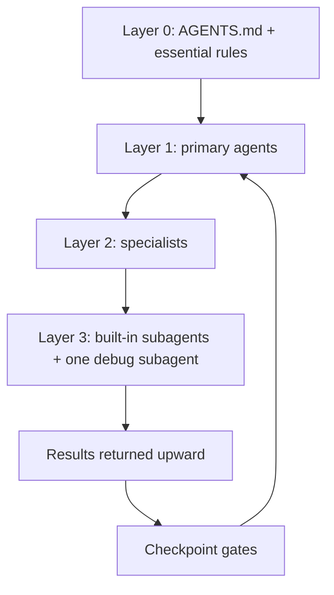
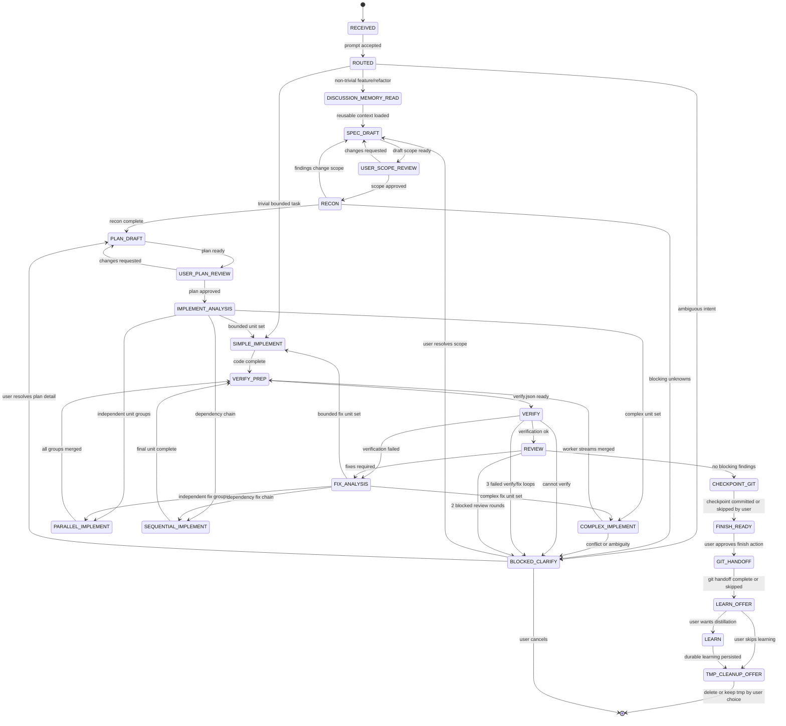
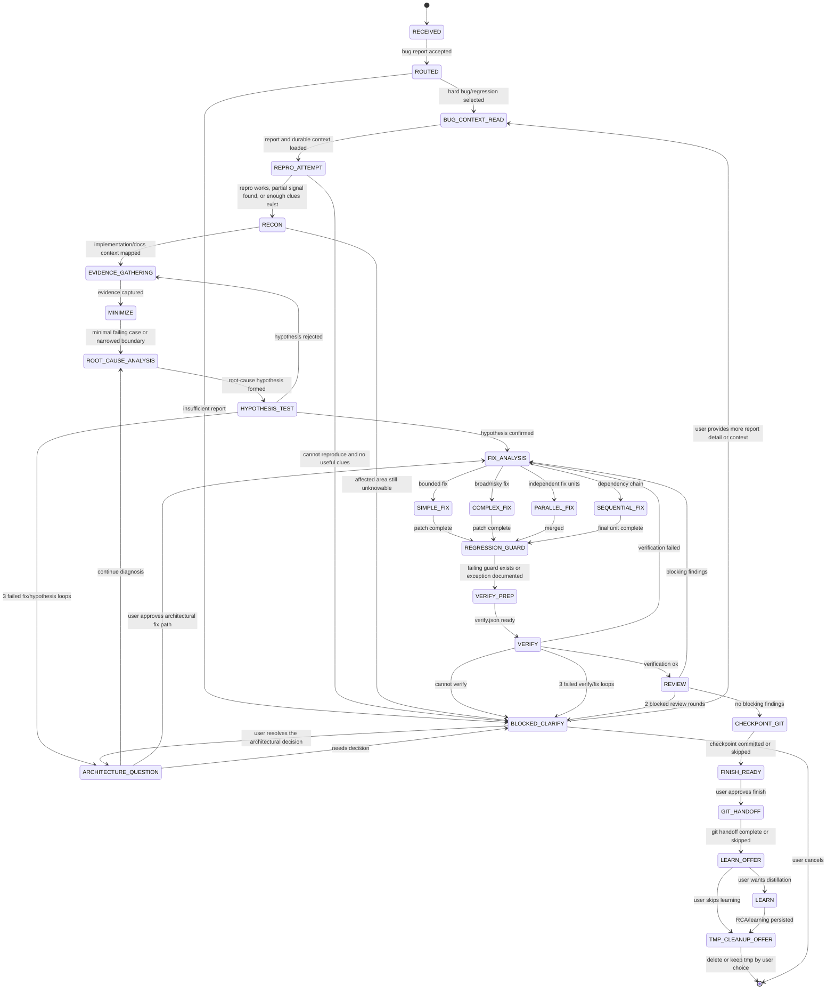
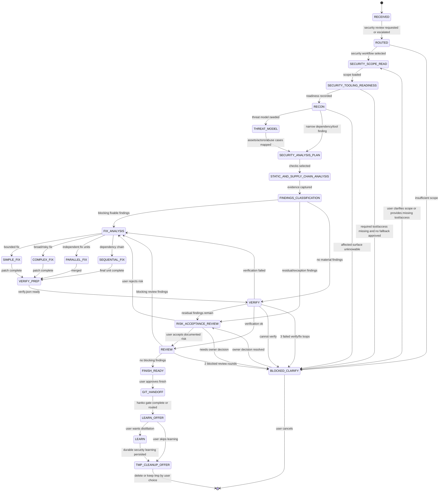
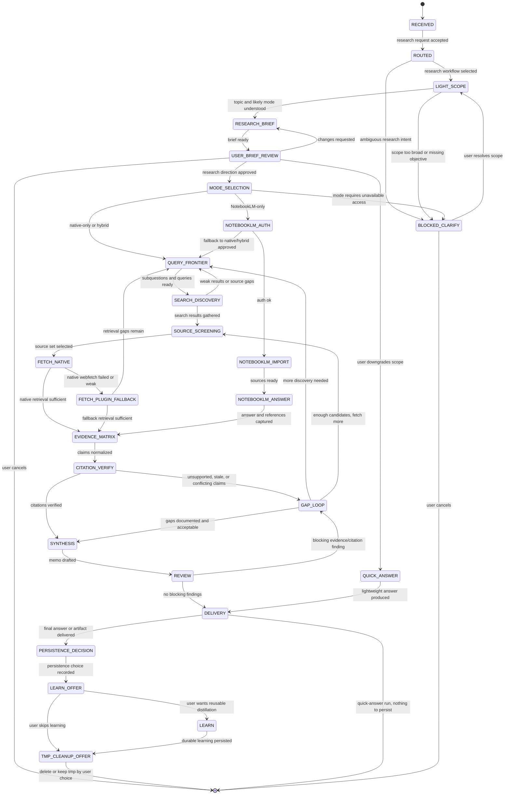
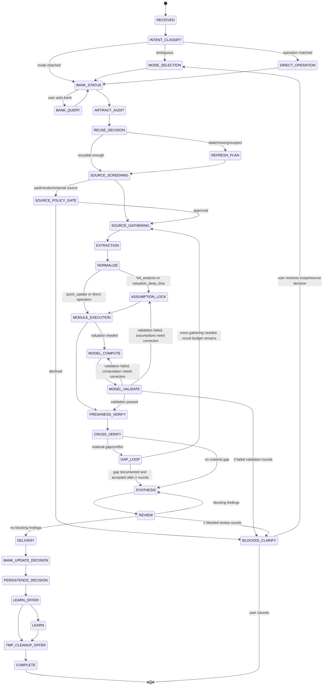

# OpenCode Harness Redesign Design

Date: 2026-06-30 (adversarial review and fleet-migration decisions applied 2026-07-02)
Status: Implemented — see plans/opencode-harness-v2-plan.md
Scope: `harnesses/opencode/` runtime fleet, install-target config, agents, skills, rules, plugins, scripts, and docs

## Goal

Rebuild the OpenCode harness around workflow-first dispatch instead of the existing 12-specialist/15-subagent/2-leaf-worker fleet.

This is a full replacement, not an extension — see "Fleet Migration" for the explicit disposition of every existing agent. The redesign moves workflow knowledge into skills, keeps only essential rules always-on, adds checkpoints at every handoff, and consolidates menial/atomic execution onto a single overridden built-in worker (`general`) instead of the old fleet's six separate leaf/execution agents (`azukiarai`, `henge`, `karakuri`, `soroban`, `yamabiko`, `makimono`).

## Confirmed Model



### Layer 0: Always-On Context

Files:

- `harnesses/opencode/config/AGENTS.md`
- `harnesses/opencode/rules/memory.md`
- `harnesses/opencode/rules/contracts.md`
- `harnesses/opencode/rules/model-budget.md`

Purpose:

- Identity and mission
- Intent triage
- Global constraints: YAGNI, KISS, DRY, SLAP, SRP
- Model-budget constraints
- Inter-agent handoff contracts
- Minimal memory contract

Important constraint: OpenCode does not parse Cursor `.mdc` metadata. Rule files loaded through `instructions` are always-on flat Markdown. Anything conditional must become a skill or be handled through AGENTS.md hierarchy.

### Layer 1: Primary Agents

Confirmed primary agents:

| Agent | Source | Role |
|---|---|---|
| `build` | OpenCode built-in | Standard OpenCode execution primary (unmodified) |
| `plan` | OpenCode built-in | Standard OpenCode planning primary (unmodified) |
| `kantoku--workflow-director` | New harness agent, `mode: primary` | Furaidē's user-facing entry point. Evaluates intent, selects workflow state machines, initializes state, dispatches specialists, manages artifacts and gates. |

`kantoku--workflow-director` is the standalone entry point for the Furaidē offering. The standard OpenCode `build` and `plan` agents remain independent, vanilla entry points and do not route to the Furaidē workflow coordinator. Git/GitHub work stays with the `hanko--git-seal` subagent.

### Layer 2: Specialists

Confirmed specialists so far (each owns at least one of Workflows #1-#5):

| Agent | Mode | Role |
|---|---|---|
| `tsukumogami--code-forgemaster` | `all` | Multi-file implementation and refactoring (Workflow #1, #2) |
| `fudo--security-guardian` | `all` | Security analysis, security review, and supply-chain review for code/dependency/CI/MCP surfaces (Workflow #3) |
| `tsuchigumo--research-weaver` | `all` | Deep research, NotebookLM offload, evidence matrices, multi-source citations (Workflow #4) |
| `daikoku--finance-steward` | `all` | Filings extraction, DCF valuation, public-company research and analysis (Workflow #5) |

All four are `mode: all`: dispatched by `kantoku--workflow-director` inside workflows, and directly Tab-reachable by the user for domain sessions.

`fudo--security-guardian`'s role is deliberately scoped to Workflow #3's application-security surface. "Agent-ecosystem security" and "secure SDLC gates" governance language is intentionally removed from this description — that scope belongs to the deferred Cyber Defense & SecOps offering below, and should not be pre-owned by this agent before that offering is actually designed.

Deferred to `harnesses/opencode/future-work/` — no confirmed workflow owns these yet, so no agent file is built for them until their offering is designed:

- Media generation and understanding: `media-production-orchestrator`, `brand-asset-manager`, `character-consistency-guard`, `design-translator` extensions for screenshot-to-code, SVG, diagram, campaign variants.
- `migration-codemod` — Future Offering #2 (Large-Scale Migration & Codemods). Not a Workflow #1-#5 owner; do not treat as a confirmed specialist. Domain overlaps the pre-existing `shiranui--migration-guide` agent file (see "Fleet Migration" below) — reconcile naming when this offering is designed, don't build a second migration agent from scratch.
- `education-tutor` — Future Offering #3 (Education & Socratic Tutoring).
- `soc-investigator`, `vuln-intelligence-analyst`, `endpoint-hardener`, `deception-operator` — Future Offering #1 (Cyber Defense & SecOps).

None of these five are registered in any Workflow #1-#5 `permission.task` allow-list.

### Fleet Migration

This redesign fully replaces the existing 12-specialist / 15-subagent / 2-leaf-worker fleet already documented in `config/AGENTS.md`, `docs/manifest-schema.md`, `docs/workflows.md`, and `agents/*.md`. That fleet is real, live, and canary-tested (`scripts/dev/canaries/RESULTS.md`, `A3: T2 subagent→subagent depth`, verdict `GO`) — this section states explicitly what happens to it, which earlier drafts of this spec did not.

| Existing fleet element | Disposition |
|---|---|
| `shiranui--migration-guide`, `enma--compliance-judge`, `daidarabotchi--infra-shaper`, `tsukuyomi--spec-oracle`, `yumemi--story-smith`, `mujina--brand-shapeshifter`, `sojobo--system-strategist`, `chizu--implementation-planner` | No confirmed workflow (#1-#5) owns these domains. Move their agent files (8) to `harnesses/opencode/future-work/` unmodified. Not deleted, not run in parallel under old conventions — reactivate when a workflow needs one. |
| `kotodama--prose-polisher`, `tengu--visual-artisan`, `mizuchi--data-current`, `tanuki--codemod-runner` | Support agents whose owning domains (writing, media/design, data architecture, migration/codemods) are all deferred offerings. Move their agent files (4) to `harnesses/opencode/future-work/` unmodified — same treatment as the 8 uncovered specialists above. |
| `yamabiko--source-echo`, `makimono--docs-scribe` | Superseded by the worker (`general`) — raw sourced retrieval and mechanical doc rendering are menial/atomic worker jobs, same logic as `azukiarai`/`henge`. Retired. |
| `mikoshi--code-pathfinder`, `tanuki--general-trickster`, `karasutengu--docs-scout` | Folded into built-in `explore` / `general` / `scout` instructions respectively (see Layer 3). Their custom agent files are retired. |
| `daikoku--finance-steward` | Carries over as the Workflow #5 owner (see Layer 2 table above); role is re-scoped per Workflow #5's rewritten state ownership. |
| `tsukumogami--code-forgemaster`, `fudo--security-guardian`, `tsuchigumo--research-weaver` | New-spec specialists; no 1:1 predecessor in the old fleet (the old fleet split coding/security/research work differently). |
| `azukiarai--data-sifter`, `henge--format-shifter`, `karakuri--command-runner`, `soroban--number-sage` | Superseded by the single overridden built-in worker (`general`) — see Layer 3 below. Not run in parallel; their existing agent files are retired. |
| `kagami--truth-mirror` | Retired. Role folds into `kagami--verifier` (used across all 5 workflows). |
| `jorogumo--synthesis-weaver` | Retired. Role folds into `daikoku--finance-steward`'s own `SYNTHESIS` ownership in Workflow #5, matching how `tsuchigumo--research-weaver` owns its own `SYNTHESIS` state in Workflow #4. |
| `oni--red-team-reviewer` | Carries over as a registered Layer 3 custom subagent (below) — judgment-heavy work that doesn't fit the worker tier. |
| `kura--knowledge-banker` | Net-new Layer 3 custom subagent (below); no predecessor file exists in `agents/` — earlier drafts wrongly described it as a carry-over. Finance knowledge-bank curation for Workflow #5. |
| `hanko--git-seal`, `bakeneko--bug-hunter` | Carry over largely unchanged; see Layer 3 and the Custom Agents table in Workflow #1. |
| `config/AGENTS.md`, `docs/manifest-schema.md`, `docs/workflows.md`, `docs/routing-manifest.json` | Rewritten to match this redesign as part of implementation. Not read as source-of-truth once this redesign lands; implementation must diff against them once, then treat them as superseded. |

### Layer 3: Built-In Subagents and Worker

Folded into built-ins:

| Former custom agent | New treatment |
|---|---|
| `mikoshi--code-pathfinder` | Fold into OpenCode built-in `explore` instructions. |
| `tanuki--general-trickster` | Fold into built-in `general` instructions. |
| `karasutengu--docs-scout` | Fold into built-in `scout` instructions. |

Kept as custom subagent:

| Agent | Why kept |
|---|---|
| `bakeneko--bug-hunter` | Pure-reasoning RCA isolation; no edit/bash; returns ExecutionPacket. (Canonical registered name — supersedes any bare `bug-hunter` reference elsewhere in this document.) |
| `kura--knowledge-banker` | Finance knowledge-bank curation: freshness/reuse/staleness classification, durable bank updates. Judgment-heavy; does not fit the worker tier. |
| `oni--red-team-reviewer` | Adversarial review across Workflows #1, #2, #3, #5 for high-stakes findings. Judgment-heavy; does not fit the worker tier. |

### The Worker Agent

`general` (OpenCode built-in, overridden via `harnesses/opencode/agents/general.md`) is the harness-wide worker for menial, atomic, no-judgment tasks: bulk structured extraction, bulk format rendering, running a bounded command/script/test and returning output faithfully, applying a pre-approved patch, single-file boilerplate edits. It is the only agent in the fleet with **unscoped** bash — specialists dispatch it for general execution instead of holding broad `permission.bash` themselves. A short list of named agents hold pattern-scoped bash/edit for their own signature commands and artifact paths (see "Scoped Permission Carve-Outs" below); every other agent is `bash: deny`.

```yaml
---
mode: subagent
model: <worker tier, defined in routing-manifest.json v10 — see "Risks and Open Questions">
temperature: 0.1
steps: 6
permission:
  bash: allow
  edit: allow
  task: deny
  webfetch: deny
  websearch: deny
---
You execute exactly what you are given and return results faithfully: stdout,
stderr, exit code, extracted fields, or formatted output. You do not interpret,
synthesize, infer missing values, or make judgment calls. If the brief is
ambiguous or the task requires judgment, stop and return what you have plus a
one-line reason instead of guessing.
```

`task: deny` makes the worker a guaranteed leaf — it cannot dispatch further subagents, which caps every dispatch chain by construction (see "OpenCode Dispatch Constraint" below). Every specialist's "Delegates To" table and every mechanical-execution state in Workflows #1-#5 must name `general` explicitly as the executor — never "delegates execution" left unnamed, and never a specialist running a general-purpose command in its own context (scoped carve-outs below are the exhaustive exceptions).

### Scoped Permission Carve-Outs

OpenCode `permission.bash` supports per-command glob patterns and `permission.edit` supports per-path patterns (verified against the official permissions docs 2026-07-02). The worker holds the only unscoped `bash`. These carve-outs exist because the named agent cannot do its job without them — nothing else gets one:

| Agent | bash carve-out | edit carve-out | Why |
|---|---|---|---|
| `general` (worker) | unscoped `allow` | unscoped `allow` | The execution surface for everything not listed here. |
| `tsukumogami--code-forgemaster` | none | unscoped `allow` | It is the complex implementer; editing code is its job. Commands still route through `general`. |
| `hanko--git-seal` | `git *`, `gh *` only | none | Owns git/GitHub actions; approval gates stay in its prompt contract. |
| `kantoku--workflow-director` | `bun scripts/workflow-state.mjs *` only | none | Must run `workflow-state.mjs init/advance` at every phase boundary. |
| `kagami--verifier` | `bun scripts/verify-run.mjs *`, `bun scripts/workflow-state.mjs *`, `bun scripts/citation-verify.mjs *` only | `.opencode/tmp/**` | Runs the verification/gate scripts itself and writes its own verification artifacts. Heavier command execution routes through `general`. |
| `kyakuhon--spec-planner` | none | `.opencode/tmp/**`, `docs/superpowers/**` | Authors scope/spec/plan artifacts per the Artifact Ledger. |
| `tsuchigumo--research-weaver` | `notebooklm *` only | `.opencode/tmp/**`, `docs/research/**` | Workflow #4 NotebookLM CLI surface; research artifacts and memos. |
| `daikoku--finance-steward` | none | `.opencode/tmp/**`, `research/financial/**` | Finance artifacts and memos; all extraction/compute scripts run via `general`. |
| `fudo--security-guardian` | none | `.opencode/tmp/**`, `docs/security/**` | Security workflow artifacts; scanners (`gitleaks`/`semgrep`/`trivy`/...) run via `general`. |
| `kura--knowledge-banker` | `bun scripts/knowledge-bank-finance.mjs *`, `bun scripts/finance-artifact-registry.mjs *` only | `research/financial/**`, `docs/knowledge/finance/**` | Bank status/query/update is its whole job; those scripts are its interface. |
| `hansei--lesson-keeper` | none | `docs/learnings/**`, `docs/postmortems/**`, `docs/security/**`, `docs/verification/**`, approved memory paths | Distills durable learning; may not touch code or tmp cleanup. |
| `oni--red-team-reviewer`, `bakeneko--bug-hunter` | none | none | Pure-reasoning read-only roles. |

Where an earlier section of this document says an edit-denied agent "creates" an artifact, this table is the mechanism: path-scoped edit for the owner's own artifact paths, unscoped edit only for the worker and the complex implementer.

## Source Layout Decisions

### Agents

Source path:

- `harnesses/opencode/agents/*.md`

Install target:

- `~/.config/opencode/agents/*.md`
- project-local target when installed with `--project`

Each agent file should use OpenCode-native frontmatter only (the agent's name comes from the filename — there is no `name:` field in OpenCode's documented schema):

- `description`
- `mode`
- `temperature` when appropriate
- `permission`
- `steps` when appropriate
- `hidden` only for non-user-facing subagents

Do not use Claude Code-only fields in OpenCode agent files:

- `mcpServers`
- `hooks`
- `memory`
- `background`
- `isolation`
- `effort`
- `initialPrompt`
- `skills`
- `permissionMode`

### Skills

Our-created skills live at repo root:

- `/d/Everything/Furaidē/skills/`
- equivalent workspace path: `/home/ace/Everything/Furaidē/skills/`

External skills are not vendored as source. They are pulled by setup instructions/scripts, then patched or supplemented in place.

Planned scripts:

- `harnesses/opencode/scripts/pull-external-skills.mjs`
- `harnesses/opencode/scripts/apply-patches.mjs`

External sources confirmed:

| Source | Skills |
|---|---|
| `obra/superpowers` | `brainstorming`, `writing-plans`, `executing-plans`, `test-driven-development`, `requesting-code-review`, `receiving-code-review`, `subagent-driven-development`, `dispatching-parallel-agents`, `finishing-a-development-branch`, `using-git-worktrees`, `using-superpowers`, `handoff`, `systematic-debugging`, `to-prd`, `to-issues`, `triage`, `grill-me`, `grill-with-docs`, `security-review`, `prototype`, `impeccable`, `humanizer`, `zoom-out` |
| `mattpocock/skills` | `codebase-design`, `diagnose`, `improve-codebase-architecture` |
| `addyosmani/agent-skills` | `incremental-implementation`, `code-simplification`, `code-review-and-quality` |

Optional external integrations are documented and invoked only when the workflow calls for them. They are not vendored as harness source. Confirmed so far: `teng-lin/notebooklm-py` for optional Workflow #4 research offload.

Our addendum skills confirmed so far:

| Skill | Purpose |
|---|---|
| `writing-plans-furaide-addendum` | Adds complexity tier, LOC budget, prior-art grep. |
| `test-driven-development-furaide-addendum` | Adds Global Constraints and stronger anti-rationalization rows. |
| `requesting-code-review-furaide-addendum` | Adds prior-art scan, SLAP/SRP scan, LOC budget check. |
| `verification-before-completion-furaide-addendum` | Adds LOC-budget verification. |
| `handoff-furaide-addendum` | Adds long-running harness mode. |

Our-created new skills confirmed so far:

| Skill | Cluster | Status |
|---|---|---|
| `post-mortem` | Debug/fix | Wired: Workflow #2 |
| `regression-test-recipe` | Debug/fix | Wired: Workflow #2 |
| `long-running-harness` | Session persistence | Not yet wired into any Skill Hooks table. Kept: near-term need for any workflow that runs long enough to risk compaction; wire in when the first workflow needs it rather than removing and rebuilding later. |
| `compaction-context` | Session persistence | Not yet wired. Same rationale as `long-running-harness`. |
| `session-progress-detector` | Session persistence | Not yet wired. Same rationale as `long-running-harness`. |
| `architect-adr` | Specialist coding | Not yet wired. Workflow #1 explicitly skips ADR creation ("Permanent File Naming", below). Kept for a future architecture-specific workflow that does create `docs/adr/` records; not built until that workflow exists. |
| `mcp-supply-chain-scan` | Specialist coding/security | Wired: Workflow #1/#2/#3 RECON Security Triage |
| `domain-scope-card` | Research | Wired: Workflow #4 |
| `evidence-matrix` | Research | Wired: Workflow #4 |
| `deep-research-outline` | Research | Wired: Workflow #4 |
| `earnings-10k-extraction` | Finance | Wired: Workflow #5, native fallback for the external `financial-statements` skill (preferred when installed) |
| `dcf-valuation-model` | Finance | Wired: Workflow #5, native fallback for the external `dcf-model` skill (preferred when installed) |
| `deal-research-due-diligence` | Finance | Not yet wired. Scope is private-deal/M&A diligence, not public-company analysis — out of scope for Workflow #5. Kept for a future deal/M&A due-diligence workflow. |
| `socratic-tutoring` | Education | Not yet wired. Owning specialist (`education-tutor`) is a deferred Future Offering (#3); build this skill when that workflow is designed. |
| `curriculum-design-with-standards` | Education | Not yet wired. Same rationale as `socratic-tutoring`. |
| `problem-set-rubric-generation` | Education | Not yet wired. Same rationale as `socratic-tutoring`. |
| `supply-chain-sbom-vex` | Cyber | Not yet wired. Owning cluster (SOC/vuln/endpoint/deception specialists) is a deferred Future Offering (#1); build this skill when that workflow is designed. |

`migration-codemod-orchestration` is intentionally not listed here: it has exactly one stated consumer, Future Offering #2 (Large-Scale Migration & Codemods), and is declared once there instead of being simultaneously "confirmed built" and "will require."

Research note: `multi-source-research-with-citations` remains the umbrella workflow name inside `tsuchigumo--research-weaver`, not a separate SKILL.md. Literature review and competitive intelligence are domain templates inside `domain-scope-card`, not separate skills for now.

Cyber skills are scoped to the deferred Cyber Defense & SecOps future offering (#1). No workflow number is assigned to them until that offering is designed — there is no Workflow #6-11 in this document.

### Plugins

Bucketed source layout:

```text
harnesses/opencode/plugins/
├── gates/
│   ├── nio.js
│   ├── nurikabe.js
│   └── komainu.js
├── failover/
│   └── migawari.js
├── hooks/
│   ├── audit-logger.js
│   └── compaction-injector.js
└── tools/
    └── web-tools.ts
```

OpenCode does not use a Claude-style `plugin.json`. Plugins are discovered by local path or npm package string in `opencode.jsonc`.

Plugin order remains runtime-sensitive until refactored:

1. `gates/nio.js`
2. `gates/nurikabe.js`
3. `gates/komainu.js`
4. `failover/migawari.js`
5. `tools/web-tools.ts`
6. `hooks/audit-logger.js`
7. `hooks/compaction-injector.js`

Risk to verify: `nurikabe.js` currently references a Stop/delivery hook. `response.before` is not in OpenCode's documented events. The redesign must verify the actual event and adjust to a supported hook.

### Scripts

Existing scripts kept:

- `scripts/workflow-state.mjs`
- `scripts/citation-verify.mjs`
- `scripts/humanize-check.mjs`
- `scripts/security-severity.mjs`
- `scripts/verify-run.mjs`
- installer/config merge scripts

New scripts planned:

- `scripts/pull-external-skills.mjs`
- `scripts/apply-patches.mjs`

## Confirmed Workflow #1: Implement a Non-Trivial Multi-File Feature

Trigger: user asks for a non-trivial feature, refactor, or implementation crossing multiple files.

Intent tier: NON-TRIVIAL.

Core model: state machine with typed artifacts. The workflow does not rely on one final handoff. It checkpoints at phase boundaries, routes units through simple or complex implementers, and ends with optional learning plus temporary-artifact cleanup.



`BLOCKED_CLARIFY` resume rule (applies to every workflow's `BLOCKED_CLARIFY` in this document): the drawn exits cover resolutions that change scope or plan. When the user's resolution changes neither — e.g. a missing tool, credential, or environment unblocks verification — resume at the state that raised the block instead of re-entering at a draft state.

### Built-In Agent Names

OpenCode built-in agents keep their official names. Do not rename or wrap them.

| Built-In Agent | Workflow #1 Use |
|---|---|
| `build` | Default primary; handles trivial/simple work directly. Does not invoke `kantoku--workflow-director` — that agent is `mode: primary` and is a separate, standalone entry point the user Tab-switches to (see "Fleet Migration" and "Workflow Coordinator Contract"). |
| `plan` | Read-only planning mode when the user explicitly wants planning without edits. |
| `general` | Overridden as the harness-wide worker (see "The Worker Agent", Layer 3): menial/atomic execution, bulk extraction/formatting, bounded command/script/test runs. Also the executor for `SIMPLE_IMPLEMENT` bounded units. |
| `explore` | Local read-only code recon. |
| `scout` | External docs, dependency, and upstream recon. |
| `compaction`, `title`, `summary` | Hidden system agents; no workflow-specific rename. |

Only Furaidē-created agents use the Japanese-English naming convention.

### Custom Agents

| Role | Agent Name | Mode | Responsibility |
|---|---|---|---|
| Workflow coordinator/router | `kantoku--workflow-director` | `primary` | Standalone entry point; the user Tab-switches to it directly. Selects workflow state machine, initializes state, dispatches specialists, manages artifact lifecycle and gates. Not dispatched by `build` — see "Workflow Coordinator Contract". |
| Spec + plan owner | `kyakuhon--spec-planner` | `all` | Owns discussion, durable-memory read, draft scope, spec, recon merge, implementation plan. |
| Complex implementer | `tsukumogami--code-forgemaster` | `all` | Owns complex, parallel, and sequential implementation units after plan approval. |
| Verifier | `kagami--verifier` | `subagent` | Owns verification evidence and gate verdicts. |
| Git/checkpoint agent | `hanko--git-seal` | `subagent` | Owns checkpoint commits, final commit/push/PR/status, conflict and CI triage, with approval gates. |
| Optional learning distiller | `hansei--lesson-keeper` | `subagent` | Distills temporary workflow artifacts into durable reusable docs/memory when user opts in. |
| Debugger | `bakeneko--bug-hunter` | `subagent` | Pure-reasoning RCA isolation for Workflow #2; no edit/bash; returns ExecutionPacket. |
| Finance knowledge curator | `kura--knowledge-banker` | `subagent` | Owns Workflow #5 knowledge-bank status, freshness/reuse classification, durable bank updates. |
| Adversarial reviewer | `oni--red-team-reviewer` | `subagent` | Owns high-stakes review across Workflows #1, #2, #3, #5. |

Do not create a custom simple implementer. Simple work uses native `build` or `general` (worker).

### Specialist Delegation Model

Top-level workflow specialists own state transitions, artifact contracts, and routing decisions. They do not collapse specialist work into themselves. This table is the canonical `permission.task` allow-list for every custom agent — each agent's frontmatter `permission.task` block is generated from its row, everything else `deny`. The lists form a DAG (no cycles, no self-dispatch) with a maximum path length of 3 nested dispatches below `kantoku` — see "OpenCode Dispatch Constraint" for the depth and interactivity rules.

| Owner | permission.task allow-list | Reason |
|---|---|---|
| `kantoku--workflow-director` | all workflow specialists, `kyakuhon--spec-planner`, `explore`, `scout`, `general`, `kagami--verifier`, `hanko--git-seal`, `hansei--lesson-keeper`, `bakeneko--bug-hunter`, `kura--knowledge-banker`, `oni--red-team-reviewer` | Coordinates workflows and routing; does not implement domain work. |
| `kyakuhon--spec-planner` | `explore`, `scout`, `general`, `tsukumogami--code-forgemaster` | Owns spec/plan and, after plan approval, routes implementation units per the Routing rules. Verification returns to `kantoku`, which dispatches `kagami--verifier`. |
| `tsukumogami--code-forgemaster` | `general` | Owns complex implementation orchestration; dispatches bounded worker units; does not self-verify completion, does not run commands itself. |
| `kagami--verifier` | `general` | Owns the verdict; runs its scoped verification scripts itself, routes heavier evidence capture through the worker. |
| `hanko--git-seal` | none — returns route recommendations only | Owns git/GitHub/release gates; does not perform deep security analysis or code fixes. |
| `fudo--security-guardian` | `explore`, `scout`, `general`, `tsukumogami--code-forgemaster`, `kagami--verifier` | Owns security analysis workflow; delegates evidence collection (scanners run via `general`), complex fixes, and verification. |
| `tsuchigumo--research-weaver` | `general`, `kagami--verifier` (depth-1 only — see dispatch rules) | Owns research direction and synthesis; delegates mechanical retrieval. When running at depth 2 (dispatched by `daikoku` in Workflow #5) it may dispatch only `general`; citation checks return upward. |
| `daikoku--finance-steward` | `general`, `kura--knowledge-banker`, `tsuchigumo--research-weaver`, `kagami--verifier` | Owns finance judgment, assumptions, and synthesis; does not run shell or compute valuation math inline. |
| `bakeneko--bug-hunter`, `oni--red-team-reviewer`, `hansei--lesson-keeper`, `kura--knowledge-banker`, `general` | none (`task: deny` — guaranteed leaves) | Pure-reasoning, curation, or execution roles; chains end here by construction. |

When a specialist finds work outside its ownership or its allow-list, it returns a RoutePacket upward instead of dispatching sideways.

### Workflow Coordinator Contract

`kantoku--workflow-director` operates as the primary agent for all Furaidē workflows. It does not rely on invocation from `build`.

Suggested config intent:

```jsonc
{
  "agent": {
    "kantoku--workflow-director": {
      "mode": "primary",
      "permission": {
        "task": {
          "*": "deny",
          "kyakuhon--spec-planner": "allow",
          "explore": "allow",
          "scout": "allow",
          "general": "allow",
          "tsukumogami--code-forgemaster": "allow",
          "kagami--verifier": "allow",
          "hanko--git-seal": "allow",
          "hansei--lesson-keeper": "allow",
          "daikoku--finance-steward": "allow",
          "fudo--security-guardian": "allow",
          "tsuchigumo--research-weaver": "allow",
          "bakeneko--bug-hunter": "allow",
          "kura--knowledge-banker": "allow",
          "oni--red-team-reviewer": "allow"
        }
      }
    }
  }
}
```

This is the complete `permission.task` allow-list for `kantoku--workflow-director`: every agent named as a state Owner anywhere in Workflows #1-#5 must appear here, or it has no permitted dispatch path (see "Implementation Verification Items" per workflow). Specialist-to-specialist dispatch is allowed, but only along the registered DAG edges in the "Specialist Delegation Model" table — the old fleet's blanket "specialist to shared-subagent only" invariant is replaced by that depth-capped DAG (decision 2026-07-02: solve in lower layers where possible, surface only critical decisions upward). Allow-lists must stay acyclic with a maximum path length of 3 nested dispatches below `kantoku`.

If OpenCode task permissions or version behavior prevent nested coordination, it returns a `RoutePacket` and the active session continues the workflow.

### Agent Markdown Shape

New and updated custom agents follow OpenCode Markdown agent format.

```markdown
---
# file: agents/kantoku--workflow-director.md (filename defines the agent name)
description: >
  Workflow Director: top-level Furaidē entry point and coordinator for non-trivial workflows.
  Use for: user interaction, routing into state-machine workflows, initializing workflow state, assigning workflow owners, managing artifact lifecycle, and coordinating checkpoint gates.
  Not for: direct code edits, shell execution, or domain-specific implementation.
  Behavior: classifies workflow intent, initializes state, dispatches approved subagents, enforces artifact contracts, and returns workflow outcome.
mode: primary
temperature: 0.2
permission:
  edit: deny
  bash:
    "bun scripts/workflow-state.mjs *": allow
    "*": deny
  webfetch: ask
  websearch: allow
  task:
    "*": deny
    kyakuhon--spec-planner: allow
    explore: allow
    scout: allow
    general: allow
    tsukumogami--code-forgemaster: allow
    kagami--verifier: allow
    hanko--git-seal: allow
    hansei--lesson-keeper: allow
    daikoku--finance-steward: allow
    fudo--security-guardian: allow
    tsuchigumo--research-weaver: allow
    bakeneko--bug-hunter: allow
    kura--knowledge-banker: allow
    oni--red-team-reviewer: allow
  question: ask
  skill:
    "*": deny
    brainstorming: allow
    writing-plans: allow
---
```

Two fields from earlier drafts are removed as not OpenCode-documented: `name:` (the filename defines the agent name) and `todowrite:` (not in the documented permission set — `read`, `edit`, `glob`, `grep`, `bash`, `lsp`, `task`, `skill`, `question`, `webfetch`, `websearch`, `external_directory`, `doom_loop`).

`kyakuhon--spec-planner` should be `mode: all`, deny bash, allow question, hold the path-scoped edit from "Scoped Permission Carve-Outs", and dispatch per its Specialist Delegation Model row (gated on dispatch probes (a)/(b)). `kagami--verifier` holds only the script-scoped bash and tmp-scoped edit from the carve-outs table. `hansei--lesson-keeper` should allow reads of temporary workflow artifacts and edits only to approved durable docs/memory paths.

### OpenCode Dispatch Constraint

Evidence base (verified 2026-07-02 against OpenCode docs, the issue tracker, and local canaries):

- Official docs still don't document subagent-to-subagent dispatch explicitly, but the issue tracker settles the capability question: OpenCode has **no architectural depth limit** on nested Task dispatch — community issues #18100 and #17721 are complaints about *unbounded* recursion, not missing support. The proposed built-in depth guard (default 3) is not merged; depth control is our config's job.
- Per-agent `permission.task` overrides for nested subagents broke in v1.1.15 and were **fixed** (issue #8114, closed via PR #8111).
- Local canary `A3` (`scripts/dev/canaries/RESULTS.md`) proved a 2-level nested chain (primary -> T1 -> T2) on this repository's install — verdict `GO`, measured against old-fleet identities.
- **Open bug #13715** (v1.2.4, unresolved): permission and question asks from depth ≥2 sessions never surface in the TUI — the inner session hangs indefinitely. Asks from depth-1 (direct children) surface fine.

Policy — solve low, decide high (decision 2026-07-02):

| Rule | Detail |
|---|---|
| Lower-layer teamwork allowed | Specialists dispatch other specialists/subagents along the registered DAG edges in "Specialist Delegation Model"; `kantoku` is not a mandatory hub for every handoff. |
| Hard depth cap: 3 nested Task calls below `kantoku` | Longest sanctioned chains: `kantoku -> kyakuhon -> tsukumogami -> general` and `kantoku -> fudo -> tsukumogami -> general`. The worker's `task: deny` ends every chain by construction. |
| Depth ≥2 is non-interactive | Because of open bug #13715: no `question: ask` and no ask-resolving permission may be reachable at depth ≥2. Any user decision discovered at depth returns a RoutePacket upward; the depth-1 owner or `kantoku` interacts with the user. All user-facing states (`USER_*` reviews, `BLOCKED_CLARIFY`, `RISK_ACCEPTANCE_REVIEW`, `ASSUMPTION_LOCK`, `SOURCE_POLICY_GATE`, the offer states) therefore execute at depth ≤1. |
| Depth-2 agents dispatch only `general` | Keeps the cap enforced by allow-list shape, not model discipline. Example: in Workflow #5 `tsuchigumo` runs at depth 2 under `daikoku` and may dispatch only `general`; citation checks return to `daikoku`/`kantoku` for `kagami`. In Workflow #4 `tsuchigumo` runs at depth 1 and dispatches `kagami` directly. |
| Anti-recursion prompt line | Every custom agent prompt carries: "Never dispatch yourself. Never re-dispatch the task you were given." (Issue #11324 shows per-target deny has had enforcement gaps — belt and suspenders on top of the DAG.) |

Probes required before implementation relies on any of this:

```text
(a) A3-style depth-2 probe re-run with the new identities (kantoku -> specialist -> general).
(b) Depth-3 probe: kantoku -> kyakuhon -> tsukumogami -> general.
(c) Enforcement probe: a target denied in permission.task is actually blocked at depth 2.
(d) Config lint: no `ask`-valued permission is reachable along any depth ≥2 chain.
```

If probe (b) fails, the affected specialist-to-specialist edges fall back to hub-and-spoke through `kantoku` — the state machines do not change, only which agent issues the Task call.

Required config shape for `kyakuhon--spec-planner` (generated from its Specialist Delegation Model row):

```jsonc
{
  "agent": {
    "kyakuhon--spec-planner": {
      "permission": {
        "task": {
          "*": "deny",
          "explore": "allow",
          "scout": "allow",
          "general": "allow",
          "tsukumogami--code-forgemaster": "allow"
        }
      }
    }
  }
}
```

### States

| State | Owner | Skills | Tools / Scripts | Input | Output Artifact | Gate |
|---|---|---|---|---|---|---|
| `RECEIVED` | `kantoku--workflow-director` primary | none | AGENTS intent triage | user prompt | workflow id | prompt accepted |
| `ROUTED` | `kantoku--workflow-director` | none | `workflow-state.mjs init` | prompt + context | route decision | tier selected |
| `DISCUSSION_MEMORY_READ` | `kyakuhon--spec-planner` | none | `read`, `glob`, `grep` | route decision + topic slug | reusable context summary | relevant durable notes inspected |
| `SPEC_DRAFT` | `kyakuhon--spec-planner` | `brainstorming`, conditional `prototype` | `read`, `glob`, `grep` | prompt + reusable context | draft scope notes; optional prototype artifact | scope ready for review |
| `USER_SCOPE_REVIEW` | user + planner | `brainstorming`, conditional `grill-me` / `grill-with-docs` | none | draft scope | approved scope or edits | explicit approval |
| `RECON` | primary/coordinator, or `kyakuhon--spec-planner` only if task dispatch is verified | `find-docs` when versioned docs are needed, conditional `zoom-out` | `explore`, `scout`, native `websearch`, native `webfetch`, plugin `web_search`, plugin `fetch_content`, `ctx7`, `gh`, OSV/Scorecard-class security checks when scoped | approved scope | recon packet + scout packet + conditional security triage | no blocking unknowns, unsafe tools rejected or escalated |
| `PLAN_DRAFT` | `kyakuhon--spec-planner` | `writing-plans` + `writing-plans-furaide-addendum`, conditional `improve-codebase-architecture` / `grill-with-docs` | `workflow-state.mjs advance --to plan` | spec + recon packet | plan file + draft `verify.json` | exact files, steps, risks, verification |
| `USER_PLAN_REVIEW` | user + planner | `writing-plans`, conditional `grill-me` / `grill-with-docs` | none | plan file | approved plan or edits | explicit approval |
| `IMPLEMENT_ANALYSIS` | `kyakuhon--spec-planner` (routes per Routing rules below) | conditional `using-git-worktrees`, `executing-plans` | dependency analysis | approved plan | implementation analysis | route justified |
| `SIMPLE_IMPLEMENT` | `build` or `general` | `test-driven-development` if behavior changes, conditional `impeccable` for frontend/UI | edit tools, `komainu.js`, `nio.js` | bounded unit brief | code diff | bounded criteria still true |
| `COMPLEX_IMPLEMENT` | `tsukumogami--code-forgemaster` | `subagent-driven-development`, `dispatching-parallel-agents` when needed, TDD when behavior changes, conditional `impeccable` for frontend/UI | worker dispatch, edit tools, gates | complex unit brief | merged code diff + worker results | worker streams returned |
| `PARALLEL_IMPLEMENT` | `tsukumogami--code-forgemaster` or primary orchestrator | `dispatching-parallel-agents`, `executing-plans` | `task` | independent unit groups | merged implementation result | no shared-state conflict |
| `SEQUENTIAL_IMPLEMENT` | `tsukumogami--code-forgemaster` or primary orchestrator | `subagent-driven-development`, `executing-plans` | `task` | dependency chain | final sequential result | dependency chain complete |
| `VERIFY_PREP` | active implementer | none | changed-file list, `verify.json` finalization | code diff | final `verify.json` | verifier has enough commands |
| `VERIFY` | `kagami--verifier` | `verification-before-completion` + addendum, conditional `agent-browser` / `browser` for UI QA | `scripts/verify-run.mjs`, `workflow-state.mjs gate` | plan + diff + `verify.json` | verification output + verdict | `ok`, `warn`, `critical`, or `blocked` |
| `FIX_ANALYSIS` | `kagami--verifier` + `kyakuhon--spec-planner` (routes per Routing rules) | `receiving-code-review` if feedback-driven | dependency analysis | failed verification/review findings | fix analysis | fix route justified |
| `REVIEW` | `oni--red-team-reviewer` | `requesting-code-review` + addendum, `receiving-code-review` | read-only review tools | verified diff | review findings | no blocking findings |
| `CHECKPOINT_GIT` | `hanko--git-seal` | `github` | `git`, `gh` when needed | reviewed/verified checkpoint | checkpoint metadata | user approves mutating git action |
| `FINISH_READY` | planner/verifier summary | `finishing-a-development-branch` | summary generation | verified/reviewed diff | finish summary | user approves finish path |
| `GIT_HANDOFF` | `hanko--git-seal` | `github` | `git`, `gh`, CI/status checks, release/security readiness checks | approved finish summary | commit/PR/status metadata + finish-gate findings | mutating git actions approved; findings routed |
| `LEARN_OFFER` | planner/verifier | none | question prompt | workflow artifacts | user learning decision | user chooses yes/no |
| `LEARN` | `hansei--lesson-keeper` | optional project memory/docs skill if available, conditional `handoff` for long-running context | `read`, approved `edit` | temporary artifacts | durable learning/spec/plan updates | reusable facts persisted |
| `TMP_CLEANUP_OFFER` | planner/verifier | none | question prompt | temp artifact list | cleanup decision | user chooses delete or keep |
| `BLOCKED_CLARIFY` | current owner | relevant active skill | question prompt | ambiguity/blocker | clarified decision | resume or cancel |

### Conditional Skill Hooks

Workflow #1 keeps a lean state machine and loads skills only when their trigger conditions match. The coordinator or current owner must check the applicable hooks before proceeding through each state.

| Skill | Trigger In Workflow #1 | State |
|---|---|---|
| `brainstorming` | New feature, behavior change, open design choice, or user-facing scope discussion. | `SPEC_DRAFT`, `USER_SCOPE_REVIEW` |
| `prototype` | UI direction, state-machine behavior, data model, or interaction needs a throwaway proof before committing to the spec. | `SPEC_DRAFT` before `USER_SCOPE_REVIEW` |
| `grill-me` | User wants the plan challenged, assumptions stress-tested, or there is a high-cost irreversible choice. | `USER_SCOPE_REVIEW`, `USER_PLAN_REVIEW` |
| `grill-with-docs` | Plan or scope must be challenged against existing project language, specs, durable learning, or architecture docs. | `USER_SCOPE_REVIEW`, `PLAN_DRAFT`, `USER_PLAN_REVIEW` |
| `zoom-out` | Agent is unfamiliar with a subsystem and needs broader context before narrowing to files. | `DISCUSSION_MEMORY_READ`, `RECON` |
| `find-docs` | Versioned library, framework, SDK, CLI, or API behavior matters. | `RECON` |
| `improve-codebase-architecture` | Refactor, architecture, seam, testability, or module-depth concern appears in scope. | `PLAN_DRAFT` |
| `using-git-worktrees` | Current workspace is dirty, implementation is risky, or isolation is needed before plan execution. | `IMPLEMENT_ANALYSIS` |
| `executing-plans` | A written implementation plan is being executed in phases with review checkpoints. | `IMPLEMENT_ANALYSIS`, `PARALLEL_IMPLEMENT`, `SEQUENTIAL_IMPLEMENT` |
| `subagent-driven-development` | Sequential implementation needs subagents where later work depends on earlier outputs. | `COMPLEX_IMPLEMENT`, `SEQUENTIAL_IMPLEMENT` |
| `dispatching-parallel-agents` | Two or more independent implementation/recon streams can run without shared state. | `COMPLEX_IMPLEMENT`, `PARALLEL_IMPLEMENT` |
| `test-driven-development` / `tdd` | Behavior changes, bug guards, or regression-prone logic require red-green-refactor. | `SIMPLE_IMPLEMENT`, `COMPLEX_IMPLEMENT`, `FIX_ANALYSIS` |
| `impeccable` | Frontend interface, UX, visual hierarchy, accessibility, responsive behavior, or design-system fit matters. | `SPEC_DRAFT`, `SIMPLE_IMPLEMENT`, `COMPLEX_IMPLEMENT`, `REVIEW` |
| `agent-browser` / `browser` | Browser interaction, UI QA, screenshots, form testing, or web-app dogfooding is needed. | `VERIFY` |
| `requesting-code-review` | Implementation is complete enough for adversarial review. | `REVIEW` |
| `receiving-code-review` | Review or verification feedback must be evaluated before applying fixes. | `FIX_ANALYSIS`, `REVIEW` |
| `verification-before-completion` | Before any claim of completion, passing tests, fixed behavior, or readiness. | `VERIFY`, `FINISH_READY` |
| `finishing-a-development-branch` | Verified work needs an integration decision. | `FINISH_READY` |
| `github` | GitHub/git operation or release/security finish gate is requested through `hanko--git-seal`. | `CHECKPOINT_GIT`, `GIT_HANDOFF` |
| `handoff` | Work is long-running, context is nearing compaction, or another session/agent must resume. | `LEARN`, `BLOCKED_CLARIFY` |

Web-search-specific skills such as `tavily-search`, `tavily-extract`, `tavily-crawl`, `tavily-map`, `brave-search`, and `bx` are not default recon paths for any workflow in this document (Workflow #1-#5). Use native `websearch`/`webfetch` first, then the harness `web-tools.ts` plugin fallback. Invoke those external search skills only when the user explicitly asks for them or when the workflow's approved tool policy changes. This rule is stated once, here, and applies globally — it is not restated per workflow.

### SDLC Principles Carried Into Workflow #1

Keep the complete principle set available during Workflow #1 planning. Narrowing to the most relevant principles happens in the implementation plan for the specific task.

| Principle | Brief | Likely Stage |
|---|---|---|
| YAGNI | Do not build what is not needed now. | spec, plan, review |
| KISS | Prefer the simplest correct design. | plan, implementation analysis |
| DRY | Avoid repeated logic, but do not abstract too early. | review, simplification |
| SRP | One module should have one reason to change. | implementation analysis, review |
| SLAP | Keep code at one level of abstraction per section. | review, simplification |
| SOLID | Use OO/module design rules when the implementation shape needs them. | architecture-heavy units |
| TDD | Red, green, refactor when behavior changes or bugs are fixed. | implementation, fix loop |
| BDD | Express behavior in user-visible acceptance terms. | spec, verification |
| DDD | Use domain language consistently when domain modeling matters. | spec, durable learning |
| Lean | Reduce waste; validate before building. | recon, prior-art scan |
| CI/CD | Keep work continuously verifiable and shippable. | verification, git checkpoints |
| Trunk-Based Development | Prefer small changes and frequent integration over long-lived drift. | git checkpoints |
| Shift-Left Security | Identify security risks before coding and before PR. | recon, implementation analysis |
| Threat Modeling | Identify assets, actors, abuse cases, and mitigations for risky surfaces. | security-relevant branches |
| Progressive Delivery | Use flags, staged rollout, and rollback paths for risky production changes. | rollout-sensitive plans |
| Observability | Logs, metrics, or traces should prove production behavior when relevant. | plan, verification |
| Supply-Chain Hygiene | Check dependencies, licenses, maintenance, and vulnerabilities. | recon/scout |

### Recon Tool Policy

External lookup order:

```text
1. Native websearch for discovery.
2. Native webfetch for retrieval.
3. ctx7 CLI for versioned library/API docs when relevant.
4. gh for GitHub issues, PRs, releases, upstream examples.
5. web-tools.ts plugin fallback when native output fails, is weak, quota-limited, stale, too small, unable to fetch the target page, or needs provider fallback.
```

Plugin fallback tools:

```text
plugins/tools/web-tools.ts:
  web_search
  fetch_content
  maps_search
```

Native tools remain first choice. The plugin is the resilience path, not the default path for Workflow #1 recon.

### Recon Prior-Art / Build-vs-Buy Gate

Recon must perform a prior-art/build-vs-buy check before custom implementation.

Prefer an existing maintained tool/library when it is simpler, safer, compatible, and cheaper than building custom code. Reject existing options only with explicit reasons: poor fit, license risk, security risk, maintenance risk, size, integration cost, or missing required behavior.

Prior-art sources:

| Source Type | Examples |
|---|---|
| Official docs | framework docs, SDK docs, API references, migration guides |
| Versioned docs | `ctx7` for library/API lookup |
| Package registries | npm, PyPI, crates.io, Maven Central, Go packages, Docker Hub |
| Source repos | GitHub releases, issues, PRs, examples, discussions |
| Security sources | OSV, GitHub Advisories, NVD, OpenSSF Scorecard, SLSA notes |
| Ecosystem radars | Thoughtworks Tech Radar, CNCF Landscape, OWASP guidance |
| Standards | IETF RFCs, W3C, WHATWG, TC39, OpenAPI, SPDX |
| Real examples | official starter templates, mature open-source apps, reference implementations |
| Benchmarks | reproducible independent benchmarks over vendor claims |

Prior-art table:

```markdown
## Prior Art / Build-vs-Buy

| Need | Existing Tool/Library | Source | Fit | Risks | Decision |
|---|---|---|---|---|---|
```

Scout output must explicitly say:

```text
Existing option found: yes/no
If yes: why use or reject it
If no: why custom implementation is justified
```

### RECON Security Triage

`RECON_SECURITY_TRIAGE` is an internal gate inside `RECON`, not a separate top-level state. It is lightweight and scoped to the affected surface so Workflow #1 does not become a full security audit.

Run it before `PLAN_DRAFT` when any of these are true:

- Any dependency, tool, library, package, MCP server, plugin, installer, or external service is affected or considered.
- Any lockfile, manifest, package config, CI workflow, auth/security-sensitive file, generated directory, vendor directory, binary artifact, or ignored tool cache is touched.
- `scout` finds external alternatives during prior-art/build-vs-buy analysis.

Checks:

| Check | Tool / Source | Purpose |
|---|---|---|
| Known vulnerabilities or malicious packages | OSV-Scanner, OSV.dev, GitHub Advisories | Identify CVE/MAL records in affected dependencies and tools. |
| Lockfile/manifests present | `explore`, OSV supported lockfile list | Avoid unpinned or unscannable dependency changes. |
| Maintenance risk | GitHub metadata, OpenSSF Scorecard when relevant | Avoid abandoned or risky alternatives. |
| Deprecated package/tool | package registry, OSV-Scanner deprecation support where available | Avoid adopting deprecated components. |
| Dangerous directories | local recon | Flag vendored deps, generated code, ignored dirs, binary artifacts, and checked-in tool caches. |
| CI/workflow risk | Scorecard concepts, local `.github/workflows/` recon | Flag dangerous workflow or token-permission edits when touched. |

Security triage output:

```text
.opencode/tmp/<workflow-id>/security-triage.md
```

Schema:

```markdown
# RECON Security Triage

## Scope
- affected files:
- affected lockfiles/manifests:
- dependencies/tools checked:

## Findings
| Item | Source | Severity | Finding | Action |
|---|---|---|---|---|

## Alternatives
| Rejected Item | Reason | Alternative | Source |
|---|---|---|---|

## Verdict
- ok | warn | critical | escalate
- required_action (only set when verdict is `critical`): fix-in-place | scout-alternative | accept-risk-pending-approval

## Required Follow-up
- action:
- owner:
```

Verdicts — this is the same 4-tier vocabulary used by Workflow #3's `FINDINGS_CLASSIFICATION` (see that workflow's "Findings Classification" section). RECON triage and Workflow #3 findings classification are the same "how bad is this" question at two different points in the pipeline; they share one vocabulary instead of two.

| Verdict | Meaning | Next Step |
|---|---|---|
| `ok` | No material issue found. | Continue workflow. |
| `warn` | Low/medium issue not blocking current task. | Record in recon packet and continue. |
| `critical` | Must be resolved before the affected plan/fix proceeds. `required_action` says how: `fix-in-place` (patch it), `scout-alternative` (chosen tool/library/path is known vulnerable, malicious, deprecated, unmaintained, or unsafe — scout alternatives before proceeding), or `accept-risk-pending-approval` (route to `RISK_ACCEPTANCE_REVIEW` in Workflow #3). | Stay in `RECON` for `fix-in-place`/`scout-alternative`; route to Workflow #3's `RISK_ACCEPTANCE_REVIEW` for `accept-risk-pending-approval`. |
| `escalate` | High/critical vulnerability, malicious package, secret exposure, dangerous workflow, auth/security-sensitive path, or unsafe tool behavior beyond what this workflow can autonomously resolve. | Route to Workflow #3/security workflow before implementation continues (or, if already inside Workflow #3, to a human security owner). |

If triage finds a `critical` issue, do not patch around the unsafe dependency/tool first. Scout alternatives, compare fit/security/maintenance, then update the plan, accept the risk with explicit approval, or escalate to the security workflow.

Implementation-plan candidate commands, selected only when relevant:

```bash
osv-scanner scan source --lockfile <affected-lockfile>
osv-scanner scan source -r <affected-subdir>
scorecard --repo=<github-url>
bun audit
uv pip audit / pip-audit
cargo audit
govulncheck
```

### Recon Artifacts

Temporary by default:

```text
.opencode/tmp/<workflow-id>/scope.md
.opencode/tmp/<workflow-id>/recon-packet.md
.opencode/tmp/<workflow-id>/scout-packet.md
.opencode/tmp/<workflow-id>/security-triage.md
```

Recon packet schema:

```markdown
# Recon Packet

## Local Code Findings
| Area | Files | Existing Pattern | Risk |
|---|---|---|---|

## External Findings
| Source | Tool | Version/Date | Finding | Relevance |
|---|---|---|---|---|

## Prior Art / Build-vs-Buy
| Need | Existing Tool/Library | Source | Fit | Risks | Decision |
|---|---|---|---|---|---|

## Security Triage
- triage artifact: `.opencode/tmp/<workflow-id>/security-triage.md`
- verdict:
- blocking alternatives required:

## Affected Files
- `path`: reason

## Test/Verification Surface
- command:
- why:

## Planning Constraints
- constraint:
- source:

## Open Questions
- question:
- blocking: yes/no
```

No final executor plan should be written for a non-trivial workflow without recon, unless the user explicitly chooses to skip recon.

### Implementation Analysis

`IMPLEMENT_ANALYSIS` consumes the approved plan and emits a unit schedule.

Artifact:

```text
.opencode/tmp/<workflow-id>/implementation-analysis.md
```

Schema:

```markdown
# Implementation Analysis

## Units
| Unit | Files | Kind | Complexity | Depends On | Can Run Parallel | Owner |
|---|---|---|---|---|---|---|

## Route Decision
- simple units:
- complex units:
- sequential chain:
- parallel groups:

## Blockers
- blocker:
- blocks units:

## Checkpoints
- after unit/group:
- git checkpoint recommended: yes/no
- reason:
```

Routing rules:

| Condition | Route |
|---|---|
| Unit is 3 files or fewer, 100 LOC or fewer, no risky surface | `SIMPLE_IMPLEMENT` |
| Unit is risky, broad, uncertain, cross-cutting, or needs multiple verification commands | `COMPLEX_IMPLEMENT` |
| Units share no files/state and have no dependency edge | `PARALLEL_IMPLEMENT` |
| Unit B needs Unit A's result | `SEQUENTIAL_IMPLEMENT` |

Simple criteria:

| Criterion | Limit |
|---|---|
| File count | 3 files or fewer |
| Expected diff | 100 changed LOC or fewer |
| Risk surface | no auth, security, payment, data-loss, persistence, or schema change |
| API surface | no public API or dependency upgrade |
| Verification | one focused command enough |
| Pattern | existing pattern is obvious from recon |
| Revertability | trivial revert |

Complex criteria:

| Trigger | Route |
|---|---|
| More than 3 files or more than 100 LOC | `tsukumogami--code-forgemaster` |
| Unknown affected file set | `tsukumogami--code-forgemaster` |
| New module or boundary | `tsukumogami--code-forgemaster` |
| Migration, codemod, dependency upgrade, or API break | migration workflow or complex implementer |
| Security, compliance, finance, auth, persistence, or data-risk surface | specialist workflow first |
| Parallel implementation streams needed | `tsukumogami--code-forgemaster` |
| Multiple verification commands needed | `tsukumogami--code-forgemaster` + `kagami--verifier` |

### Fix Analysis

`FIX_ANALYSIS` mirrors `IMPLEMENT_ANALYSIS`.

Inputs:

```text
.opencode/tmp/<workflow-id>/verification-output.json
.opencode/tmp/<workflow-id>/verification-summary.md
.opencode/tmp/<workflow-id>/review-findings.md
```

Output:

```text
.opencode/tmp/<workflow-id>/fix-analysis.md
```

Fix analysis must classify each issue into simple, complex, parallel, or sequential fix units before returning to implementation. Failed verification should not blindly rerun the same implementer path.

### Verification

`kagami--verifier` owns the verification verdict.

**Loop cap:** the `VERIFY -> FIX_ANALYSIS -> {implementer} -> VERIFY_PREP -> VERIFY` cycle is capped at 3 rounds, matching the existing fleet's `max_ralph_iterations` default and Workflow #2's hypothesis-loop cap. On the 3rd consecutive `VERIFY` failure for the same unit, route to `BLOCKED_CLARIFY` instead of re-entering `FIX_ANALYSIS` — repeated verification failure on the same unit is a signal the fix approach itself is wrong, not that another attempt will succeed.

**Review loop cap:** the `REVIEW -> FIX_ANALYSIS -> {implementer} -> ... -> REVIEW` cycle is separately capped at 2 blocked rounds. If review still blocks after 2 fix rounds, route to `BLOCKED_CLARIFY` — the reviewer and the implementer disagree at a level the user needs to arbitrate. The same 2-round review cap applies to Workflow #2, #3, and #5's `REVIEW` states.

Inputs:

```text
docs/superpowers/plans/<topic>-plan.md
.opencode/tmp/<workflow-id>/verify.json
.opencode/tmp/<workflow-id>/implementation-analysis.md
changed-file list
```

Outputs:

```text
.opencode/tmp/<workflow-id>/verification-output.json
.opencode/tmp/<workflow-id>/verification-summary.md
```

Verifier responsibilities:

| Responsibility | Detail |
|---|---|
| Run commands | Use `scripts/verify-run.mjs` when the plan provides structured verification. |
| Capture evidence | Store command, exit code, relevant output, and timestamp. |
| Decide verdict | `ok`, `warn`, `critical`, or `blocked`. |
| Update gate | Use `workflow-state.mjs gate`; never write state files directly. |
| Route failures | Send failures to `FIX_ANALYSIS`, not directly to editing. |

### Git Checkpoints

`furaide-git` is not part of Workflow #1. Use `hanko--git-seal`.

There is no `PR_READY` workflow state. PR creation, PR status, and CI status are internal outcomes of `hanko--git-seal`.

`hanko--git-seal` may be invoked at crucial checkpoints, not only at the end:

| Moment | Action |
|---|---|
| After approved spec/plan if useful | optional checkpoint commit |
| After major implementation unit/group | optional checkpoint commit |
| After verification clean | finishing commit/PR flow |
| On conflict or CI failure | conflict/CI triage and fix routing |
| At final handoff | return git/PR/status metadata |

During finish or PR handoff, `hanko--git-seal` owns the release/security gate check. It presents findings and recommends the next route. This table is canonical — Workflow #2, #3, and any future workflow with a `GIT_HANDOFF` state reference it rather than redefining it:

| Finding Type | Recommended Route |
|---|---|
| Simple, directly fixable issue | Present proof and suggest `build` or `general` (worker) fix plus `kagami--verifier` |
| Complex but implementation-focused issue | Present proof and suggest `tsukumogami--code-forgemaster` plus `kagami--verifier` |
| Security-analysis-heavy issue | Present proof and suggest Workflow #3 through `kantoku--workflow-director` and `fudo--security-guardian` |
| CI/status/ruleset issue | Present exact failing check, likely cause, and options for user approval |

For newly implemented features or high-risk changes, `hanko--git-seal` should suggest Workflow #3 as an optional security review before final PR/release handoff. The suggestion is scoped: docs-only or low-risk changes can skip it; dependency, CI, MCP/tooling, plugin, installer, auth/security-sensitive, generated/vendor, or command-execution changes should strongly recommend it.

Rules:

| Rule | Requirement |
|---|---|
| Approval | Ask before every mutating git action. |
| Branch | Commit to the active worktree/branch. |
| Force | No force-push. |
| Mainline | No direct push to `master`. |
| Shape | Prefer small checkpoint commits at meaningful boundaries over one final mega-commit when the user approves. |
| Recovery | Checkpoint commits exist so the user can traverse back to where an issue appeared. |

### Artifact Ledger

| Artifact | Path | Persistence | Created By | Consumed By |
|---|---|---|---|---|
| Workflow state | runtime state path managed by `workflow-state.mjs` | temporary runtime | `workflow-state.mjs` only | gates, agents, plugins |
| Journal | runtime journal path managed by `workflow-state.mjs` | temporary/audit runtime | `workflow-state.mjs` | recovery/debug |
| Draft scope notes | `.opencode/tmp/<workflow-id>/scope.md` | temporary | `kyakuhon--spec-planner` | user, recon |
| Spec doc | `docs/superpowers/specs/<topic>-design.md` | permanent | `kyakuhon--spec-planner` | recon, plan, review, future discussion memory |
| Recon packet | `.opencode/tmp/<workflow-id>/recon-packet.md` | temporary by default | `explore` + planner | plan, implementer |
| Scout packet | `.opencode/tmp/<workflow-id>/scout-packet.md` | temporary by default | `scout` | recon packet, plan |
| Security triage | `.opencode/tmp/<workflow-id>/security-triage.md` | temporary by default | recon owner, `scout`, optional security specialist | recon packet, plan, security workflow escalation |
| Plan file | `docs/superpowers/plans/<topic>-plan.md` | permanent | `kyakuhon--spec-planner` | implementer, verifier |
| Implementation analysis | `.opencode/tmp/<workflow-id>/implementation-analysis.md` | temporary | planner/router | implementer |
| Worker briefs | `.opencode/tmp/<workflow-id>/worker-briefs/*.md` | temporary | `tsukumogami--code-forgemaster` | worker subagents |
| Worker results | `.opencode/tmp/<workflow-id>/worker-results/*.md` | temporary | worker subagents | code-forgemaster, verifier |
| Verification manifest | `.opencode/tmp/<workflow-id>/verify.json` | temporary | planner, finalized by implementer | verifier |
| Verification output | `.opencode/tmp/<workflow-id>/verification-output.json` | temporary by default | `kagami--verifier` | reviewer, git subagent |
| Verification summary | `.opencode/tmp/<workflow-id>/verification-summary.md` | temporary by default | `kagami--verifier` | user, PR body, learn stage |
| Review findings | `.opencode/tmp/<workflow-id>/review-findings.md` | temporary by default | reviewer | fix analysis, verifier |
| Fix analysis | `.opencode/tmp/<workflow-id>/fix-analysis.md` | temporary | verifier + router | implementer |
| Finish summary | `.opencode/tmp/<workflow-id>/finish-summary.md` | temporary by default | verifier/planner | `hanko--git-seal`, user |
| Git metadata | commit messages, PR body, PR comments | permanent external | `hanko--git-seal` | user, GitHub |

### Permanent File Naming

Use topic-first names based on the spec/plan slug. Dates belong inside the file for audit trail, not at the front of the filename.

Permanent paths:

```text
docs/superpowers/specs/<topic>-design.md
docs/superpowers/plans/<topic>-plan.md
docs/postmortems/<topic>-rca.md
docs/learnings/<topic>-learning.md
docs/security/<topic>-security.md
docs/verification/<topic>-verification.md
```

Do not create `docs/adr/YYYY-MM-DD-<topic>.md` for Workflow #1. Architecture decisions discovered during this workflow belong in the spec file unless a later architecture-specific workflow creates a separate decision record.

Suggested frontmatter for durable outputs:

```yaml
created: YYYY-MM-DD
updated: YYYY-MM-DD
workflow_id: <workflow-id>
source_spec: docs/superpowers/specs/<topic>-design.md
source_plan: docs/superpowers/plans/<topic>-plan.md
```

### Learning Stage

At the end of Workflow #1, ask:

```text
Do you want me to distill useful reusable findings from this workflow into durable project memory/docs before cleanup?
```

If yes, inspect:

```text
.opencode/tmp/<workflow-id>/scope.md
.opencode/tmp/<workflow-id>/recon-packet.md
.opencode/tmp/<workflow-id>/scout-packet.md
.opencode/tmp/<workflow-id>/implementation-analysis.md
.opencode/tmp/<workflow-id>/fix-analysis.md
.opencode/tmp/<workflow-id>/worker-results/
.opencode/tmp/<workflow-id>/verification-summary.md
.opencode/tmp/<workflow-id>/review-findings.md
```

Potential durable outputs:

| Durable Output | When |
|---|---|
| Spec file update | behavior/design decisions changed during work |
| Plan file update | implementation sequence became reusable |
| Learning file | reusable repo-specific pattern, workflow pitfall, or operational lesson |
| RCA file | bug, failure, regression, or root-cause lesson |
| Security file | accepted security risk, threat model, or control decision |
| Verification file | evidence needs long-term audit trail |

Discussion phase must read relevant durable files when present:

```text
docs/superpowers/specs/<topic>-design.md
docs/superpowers/plans/<topic>-plan.md
docs/learnings/<topic>-learning.md
docs/postmortems/<topic>-rca.md
docs/security/<topic>-security.md
docs/verification/<topic>-verification.md
```

### Temporary Cleanup

After the learning offer, ask regardless of whether learning ran:

```text
Delete temporary workflow files for <workflow-id>?
```

Choices:

| Choice | Effect |
|---|---|
| Delete tmp | remove `.opencode/tmp/<workflow-id>/` after durable outputs are written |
| Keep tmp | leave artifacts for manual inspection |

No archive mode for now. Archive adds extra machinery without a confirmed need.

**Closing-prompt consolidation:** `LEARN_OFFER` and `TMP_CLEANUP_OFFER` remain separate states for tracking, but are presented to the user as one consolidated closing prompt (two questions, one message) — never two sequential trivial prompts. Workflows #2-#5 follow the same rule for their end-of-run offer states.

### Workflow #1 Implementation Verification Items

The later implementation plan must include tests or checks for:

| Item | Required Check |
|---|---|
| `build` to coordinator dispatch | Prove `build` can invoke `kantoku--workflow-director` through Task permissions. |
| `kyakuhon--spec-planner` dispatch | Prove it can invoke `explore`, `scout`, `general`, and `tsukumogami--code-forgemaster` via `permission.task` (dispatch probes (a)/(b)); otherwise recon/implementation dispatch falls back to `kantoku`. |
| Agent inventory | `kantoku--workflow-director`, `kyakuhon--spec-planner`, `kagami--verifier`, `hansei--lesson-keeper`, and updated `hanko--git-seal` are registered in manifest/config. |
| Built-in names | `build`, `plan`, `general`, `explore`, and `scout` retain official OpenCode names. |
| Removed primary git agent | `furaide-git` is not used in Workflow #1. |
| State phases | `workflow-state.mjs` supports the needed phase/gate transitions or has compatible names documented. |
| Artifact paths | Temporary artifacts are written under `.opencode/tmp/<workflow-id>/`. |
| Permanent names | Spec/plan/learning files use topic-first slugs, not date-first filenames. |
| Verification runner | `scripts/verify-run.mjs` can consume the chosen `verify.json` format. |

## Confirmed Workflow #2: Debug a Hard Bug

Trigger: user reports a hard bug, failing test, runtime error, or regression where root cause is unclear.

Intent tier: DOMAIN-JOB debug branch.

Core model: diagnosis-first state machine. No fix is proposed or applied before reproduction evidence, implementation recon, root-cause hypothesis, and hypothesis testing. Workflow #2 uses the same coordinator, artifact, verification, checkpoint, learning, and cleanup conventions as Workflow #1.



### Debug Discipline

Workflow #2 follows the `systematic-debugging` rule: no fix before root-cause investigation. A stack trace, failing test, or user-provided guess is evidence, not a fix plan.

Required ordering:

```text
bug context
  -> reproduce symptom
  -> recon current implementation and external behavior
  -> gather targeted evidence
  -> minimize
  -> root-cause analysis
  -> hypothesis test
  -> fix analysis
  -> implementation
  -> regression guard
  -> verification
```

This ordering prevents two failure modes:

| Bad Pattern | Prevented By |
|---|---|
| Reading code forever without reproducing the symptom | `REPRO_ATTEMPT` before `RECON` |
| Fixing from stack trace vibes | `RECON`, `EVIDENCE_GATHERING`, `MINIMIZE`, `ROOT_CAUSE_ANALYSIS`, and `HYPOTHESIS_TEST` before `FIX_ANALYSIS` |

There is deliberately no user gate between diagnosis and fix implementation (decision 2026-07-02): working-tree edits are reversible, `REGRESSION_GUARD` and `VERIFY` catch bad fixes, and every mutating git action is user-gated later at `CHECKPOINT_GIT`/`GIT_HANDOFF`. Workflow #3 follows the same rule for security fixes.

### States

| State | Owner | Skills | Tools / Scripts | Input | Output Artifact | Gate |
|---|---|---|---|---|---|---|
| `RECEIVED` | `kantoku--workflow-director` primary | none | AGENTS intent triage | bug report | workflow id | report accepted |
| `ROUTED` | `kantoku--workflow-director` | `systematic-debugging` | `workflow-state.mjs init` | bug report + context | debug route decision | hard bug/regression selected |
| `BUG_CONTEXT_READ` | `kantoku--workflow-director` or debugger | `zoom-out` if subsystem is unfamiliar | `read`, `glob`, `grep` | bug report + topic slug | bug context summary | durable RCA/learning/docs inspected |
| `REPRO_ATTEMPT` | `kagami--verifier` or debug runner | `systematic-debugging` | focused test/run commands, `agent-browser` / `browser` for UI repro | bug context summary | repro log | reproducible symptom, partial signal, or explicit blocker |
| `RECON` | primary/coordinator plus `explore` and `scout` | `find-docs` when dependency/API behavior matters, `zoom-out` when subsystem is broad | `explore`, `scout`, native `websearch`, native `webfetch`, `ctx7`, `gh`, plugin fallback, OSV/Scorecard-class security checks when scoped | repro log + bug context | debug recon packet + scout packet + conditional security triage | implementation/docs context mapped, unsafe tools rejected or escalated |
| `EVIDENCE_GATHERING` | debugger | `diagnose`, `systematic-debugging` | instrumentation, targeted commands, logs | recon packet | evidence packet | facts show where the break occurs |
| `MINIMIZE` | debugger | `diagnose` | focused test/script/repro reduction | evidence packet | minimal repro or narrowed boundary | noise reduced enough for RCA |
| `ROOT_CAUSE_ANALYSIS` | `bakeneko--bug-hunter` or equivalent debugger | `systematic-debugging`, `diagnose` | read-only analysis | minimal repro + evidence + recon | root-cause analysis | specific hypothesis formed |
| `HYPOTHESIS_TEST` | verifier/debug runner | `systematic-debugging` | one-variable test commands or instrumentation | root-cause hypothesis | hypothesis test results | hypothesis confirmed, rejected, or architecture questioned |
| `FIX_ANALYSIS` | debugger + `kantoku--workflow-director` (routes per Workflow #1 Routing rules) | `receiving-code-review` if feedback-driven | dependency analysis | confirmed hypothesis | fix analysis | fix route justified |
| `SIMPLE_FIX` | `build` or `general` | `test-driven-development` / `tdd` when behavior changes | edit tools, gates | bounded fix brief | patch diff | bounded criteria still true |
| `COMPLEX_FIX` | `tsukumogami--code-forgemaster` | `subagent-driven-development`, TDD when behavior changes | worker dispatch, edit tools, gates | complex fix brief | merged patch diff + worker results | worker streams returned |
| `PARALLEL_FIX` | `tsukumogami--code-forgemaster` or primary orchestrator | `dispatching-parallel-agents`, `executing-plans` | `task` | independent fix units | merged fix result | no shared-state conflict |
| `SEQUENTIAL_FIX` | `tsukumogami--code-forgemaster` or primary orchestrator | `subagent-driven-development`, `executing-plans` | `task` | dependency fix chain | final sequential result | dependency chain complete |
| `REGRESSION_GUARD` | implementer + verifier | `test-driven-development` / `tdd` | test framework or one-off repro script | patch diff + original repro | regression guard evidence | failing-then-passing guard or documented exception |
| `VERIFY_PREP` | active implementer | none | changed-file list, `verify.json` finalization | patch diff + guard evidence | final `verify.json` | verifier has enough commands |
| `VERIFY` | `kagami--verifier` | `verification-before-completion`, `agent-browser` / `browser` for UI verification | `scripts/verify-run.mjs`, focused repro command, full relevant suite | plan + diff + `verify.json` | verification output + verdict | `ok`, `warn`, `critical`, or `blocked` |
| `REVIEW` | `oni--red-team-reviewer` or built-in review path | `requesting-code-review`, `receiving-code-review` | read-only review tools | verified patch | review findings | no blocking findings |
| `ARCHITECTURE_QUESTION` | `kantoku--workflow-director` + user | `improve-codebase-architecture`, `grill-with-docs` | question prompt | repeated failures or structural root cause | architecture decision | refactor/fix path approved or blocked |
| `CHECKPOINT_GIT` | `hanko--git-seal` | `github` | `git`, `gh` when needed | reviewed/verified checkpoint | checkpoint metadata | user approves mutating git action |
| `FINISH_READY` | debugger/verifier summary | `finishing-a-development-branch` | summary generation | verified/reviewed patch | finish summary | user approves finish path |
| `GIT_HANDOFF` | `hanko--git-seal` | `github` | `git`, `gh`, CI/status checks, release/security readiness checks | approved finish summary | commit/PR/status metadata + finish-gate findings | mutating git actions approved; findings routed |
| `LEARN_OFFER` | debugger/verifier | none | question prompt | workflow artifacts | user learning decision | user chooses yes/no |
| `LEARN` | `hansei--lesson-keeper` | `handoff` if needed | `read`, approved `edit` | temporary artifacts | RCA/learning/spec updates | reusable facts persisted |
| `TMP_CLEANUP_OFFER` | debugger/verifier | none | question prompt | temp artifact list | cleanup decision | user chooses delete or keep |
| `BLOCKED_CLARIFY` | current owner | relevant active skill | question prompt | ambiguity/blocker | clarified decision | resume or cancel |

### Debug RECON

`RECON` is required before `ROOT_CAUSE_ANALYSIS`. It supports RCA; it is not a fix-planning shortcut.

Inputs:

```text
bug report
repro output or partial symptom signal
stack traces / failing test names / logs
durable learning/RCA files
```

Uses:

| Agent / Tool | Purpose |
|---|---|
| `explore` | Read-only local code recon: related files, call paths, working examples, ownership seams, tests. |
| `scout` | External docs/upstream recon: library behavior, known bugs, changelogs, issue threads, version-specific gotchas. |
| native `websearch` / `webfetch` | First-pass current external lookup when needed. |
| `ctx7` | Versioned docs/API lookup when dependency behavior may matter. |
| `gh` | Upstream issues, releases, PRs, and examples. |
| `web-tools.ts` plugin | Fallback if native lookup fails or is weak. |

Outputs:

```text
.opencode/tmp/<workflow-id>/recon-packet.md
.opencode/tmp/<workflow-id>/scout-packet.md
```

Debug recon packet schema:

```markdown
# Debug Recon Packet

## Local Implementation Map
| Area | Files | Current Pattern | Why Relevant |
|---|---|---|---|

## Working Comparisons
| Working Case | Broken Case | Difference |
|---|---|---|

## External / Upstream Findings
| Source | Tool | Version/Date | Finding | Relevance |
|---|---|---|---|---|

## Security Triage
- triage artifact: `.opencode/tmp/<workflow-id>/security-triage.md`
- verdict:
- plausible root-cause/security link:

## Suspect Boundaries
- boundary:
- evidence:

## Commands / Observations To Gather Next
- command:
- expected observation:
```

### Debug RECON Security Triage

Run `RECON_SECURITY_TRIAGE` for implicated libraries, tools, manifests, lockfiles, generated/vendor directories, CI workflows, plugins, MCP/tooling, installer paths, auth/security-sensitive paths, and any external alternative found by `scout`.

If a known vulnerability, malicious package, deprecated dependency, unsafe tool behavior, or dangerous workflow plausibly explains the bug, include it as a root-cause hypothesis. Do not patch around an unsafe dependency/tool first. Scout alternatives, compare fit/security/maintenance, then route using the same verdict vocabulary as Workflow #1's RECON Security Triage:

| Finding | Verdict | Route |
|---|---|---|
| Low/medium unrelated warning | `warn` | Record and continue diagnosis. |
| Plausibly causal dependency/tool issue | `warn` or `critical` depending on materiality | Add to `ROOT_CAUSE_ANALYSIS` hypotheses. |
| Unsafe dependency/tool with viable alternative | `critical`, `required_action: scout-alternative` | Stay in `RECON`, scout and select alternative before `FIX_ANALYSIS`. |
| High/critical security issue, malicious package, secret exposure, or dangerous workflow | `escalate` | Escalate to Workflow #3 before fix implementation. |

Security triage output:

```text
.opencode/tmp/<workflow-id>/security-triage.md
```

### Fix Analysis

`FIX_ANALYSIS` mirrors Workflow #1 `IMPLEMENT_ANALYSIS`, but its input is the confirmed root-cause hypothesis and regression evidence.

Output:

```text
.opencode/tmp/<workflow-id>/fix-analysis.md
```

Fix analysis must classify each issue into simple, complex, parallel, or sequential fix units before editing. Failed verification should not blindly rerun the same implementer path.

### Regression Guard

`REGRESSION_GUARD` is mandatory unless the verifier records why an automated or one-off guard is impossible.

Acceptable guard forms:

| Guard | When |
|---|---|
| Automated test | Existing test framework can express the bug. |
| One-off repro script | No test framework exists, but a script can reproduce the failure. |
| Browser/UI repro | Bug is visual or interaction-dependent. Use `agent-browser` / `browser`. |
| Documented exception | External, timing-dependent, or environment-only bug cannot be reliably reproduced. Must include evidence and monitoring/follow-up. |

Guard evidence must show red-green when feasible:

```text
before fix: guard fails or reproduces symptom
after fix: guard passes and relevant suite passes
```

### Artifacts

Temporary:

```text
.opencode/tmp/<workflow-id>/bug-report.md
.opencode/tmp/<workflow-id>/bug-context.md
.opencode/tmp/<workflow-id>/repro-log.md
.opencode/tmp/<workflow-id>/recon-packet.md
.opencode/tmp/<workflow-id>/scout-packet.md
.opencode/tmp/<workflow-id>/security-triage.md
.opencode/tmp/<workflow-id>/evidence-packet.md
.opencode/tmp/<workflow-id>/minimal-repro.md
.opencode/tmp/<workflow-id>/root-cause-analysis.md
.opencode/tmp/<workflow-id>/hypothesis-tests.md
.opencode/tmp/<workflow-id>/fix-analysis.md
.opencode/tmp/<workflow-id>/regression-guard.md
.opencode/tmp/<workflow-id>/verify.json
.opencode/tmp/<workflow-id>/verification-output.json
.opencode/tmp/<workflow-id>/verification-summary.md
.opencode/tmp/<workflow-id>/review-findings.md
.opencode/tmp/<workflow-id>/finish-summary.md
```

Durable if learning is approved:

```text
docs/postmortems/<topic>-rca.md
docs/learnings/<topic>-learning.md
docs/verification/<topic>-verification.md
```

Use topic-first names based on the workflow/spec slug. Dates belong inside frontmatter/body, not at the front of filenames.

### Skill Hooks

| Skill | Trigger In Workflow #2 | State |
|---|---|---|
| `systematic-debugging` | Always for bugs, failures, regressions, runtime errors, and unexplained behavior. | `ROUTED`, `REPRO_ATTEMPT`, `ROOT_CAUSE_ANALYSIS`, `HYPOTHESIS_TEST` |
| `diagnose` | Hard bug, regression, performance issue, or unclear root cause. | `EVIDENCE_GATHERING`, `MINIMIZE`, `ROOT_CAUSE_ANALYSIS` |
| `zoom-out` | Debugger is unfamiliar with subsystem or broad context is needed. | `BUG_CONTEXT_READ`, `RECON` |
| `find-docs` | Library/API/version behavior may explain the issue. | `RECON` |
| `agent-browser` / `browser` | Browser/UI repro or web-app QA is needed. | `REPRO_ATTEMPT`, `REGRESSION_GUARD`, `VERIFY` |
| `test-driven-development` / `tdd` | Regression guard or behavior-changing fix is required. | `REGRESSION_GUARD`, `SIMPLE_FIX`, `COMPLEX_FIX` |
| `dispatching-parallel-agents` | Independent fix or recon units can run without shared state. | `PARALLEL_FIX` |
| `subagent-driven-development` | Dependent fix chain needs staged workers. | `COMPLEX_FIX`, `SEQUENTIAL_FIX` |
| `executing-plans` | Written fix plan is executed in phases. | `FIX_ANALYSIS`, `PARALLEL_FIX`, `SEQUENTIAL_FIX` |
| `improve-codebase-architecture` | Three failed fix/hypothesis loops or root cause points to structural coupling. | `ARCHITECTURE_QUESTION` |
| `grill-with-docs` | Architecture/root-cause decision should be challenged against project docs and durable learning. | `ARCHITECTURE_QUESTION` |
| `receiving-code-review` | Review/verification feedback needs evaluation before more edits. | `FIX_ANALYSIS`, `REVIEW` |
| `requesting-code-review` | Patch is verified enough for adversarial review. | `REVIEW` |
| `verification-before-completion` | Before claiming fixed, passing, or ready. | `VERIFY`, `FINISH_READY` |
| `finishing-a-development-branch` | Verified fix needs integration decision. | `FINISH_READY` |
| `github` | GitHub/git operation or release/security finish gate is requested through `hanko--git-seal`. | `CHECKPOINT_GIT`, `GIT_HANDOFF` |
| `handoff` | Investigation is long-running, blocked, or nearing compaction. | `LEARN`, `BLOCKED_CLARIFY` |

### ExecutionPacket Contract

Defined in `rules/contracts.md`. Workflow #2 keeps this contract for debugger-to-runner or debugger-to-implementer handoffs, but no longer assumes a standalone command-runner agent is required.

```yaml
execution_packet:
  bug_summary: string
  ranked_hypotheses:
    - hypothesis: string
      confidence: number
      files_to_inspect: string[]
      commands_to_run: string[]
      expected_observations: string[]
      stop_criteria: string
  recommended_next_action: string
  stop_criteria: string
```

### Workflow #2 Implementation Verification Items

The later implementation plan must include tests or checks for:

| Item | Required Check |
|---|---|
| Debug route | Prove `build` or primary coordinator routes hard bugs to Workflow #2. |
| RECON dispatch | Prove `explore` and `scout` can be dispatched for debug recon. |
| Security triage | Prove scoped security triage artifact is created when affected dependencies/tools/manifests/CI/security paths are in scope. |
| No-fix-before-RCA | Agent instructions prevent fixes before `ROOT_CAUSE_ANALYSIS` and `HYPOTHESIS_TEST`. |
| Regression guard | Verifier rejects completion without failing-then-passing guard or documented exception. |
| Fix routing | Simple/complex/parallel/sequential fix routes reuse Workflow #1 routing rules. |
| Durable learning | RCA/learning files use topic-first slugs if the user opts into `LEARN`. |

## Confirmed Workflow #3: Security Analysis / Security Remediation

Trigger: explicit security review/audit, security-sensitive diff, dependency/tool/MCP/plugin/installer/CI change, auth/crypto/secrets/path traversal/command execution surface, an `escalate` verdict from Workflow #1/#2's RECON Security Triage, or a `hanko--git-seal` finish-gate finding that needs deeper security analysis.

Intent tier: SECURITY DOMAIN-JOB.

Core model: adaptive security-review state machine. Workflow #3 owns security analysis and remediation. It is not the git release gate. Pre-commit, pre-push, PR, and release gate checks belong to `hanko--git-seal`, which presents proof and options to the user, then recommends either a basic fix path, complex fix path, or Workflow #3 when deeper security analysis is needed. Workflow #3 uses the same checkpoint, learning, and cleanup conventions as Workflow #1 (`CHECKPOINT_GIT` is not a Workflow #3 state — see "Ownership Boundary" below — but `GIT_HANDOFF`, `LEARN_OFFER`, `LEARN`, and `TMP_CLEANUP_OFFER` follow Workflow #1's rules unless stated otherwise here).

Workflow #3 does not run every possible security step on every request; `fudo--security-guardian` selects the relevant states, tools, and subagents based on scope and findings.



### Ownership Boundary

Workflow #3 is not the release gate. Release/security gate checks belong to `hanko--git-seal`.

| Concern | Owner |
|---|---|
| Are pre-commit, pre-push, PR, release, and CI/security gates ready, and what failed? | `hanko--git-seal` |
| What proof exists for a git/security gate failure, and what are the user's options? | `hanko--git-seal` |
| Is this a real security problem, what is the threat model, and how do we fix or accept risk? | `fudo--security-guardian` / Workflow #3 |
| Is the security fix verified? | `kagami--verifier` |
| Is this ready for commit/PR/CI checks? | `hanko--git-seal` |

`hanko--git-seal` routes finish-gate findings using the same routing table as Workflow #1's "Git Checkpoints" section (below) — one canonical table, not redefined per workflow.

### Top-Level Specialist

Workflow owner: `fudo--security-guardian`.

It delegates rather than doing everything itself.

| Work | Delegate |
|---|---|
| Workflow routing and state | `kantoku--workflow-director` |
| Local code/security surface mapping | `explore` |
| Upstream/package/docs/security advisory recon | `scout` |
| Versioned library/API behavior | `find-docs` / `ctx7` |
| Static/supply-chain evidence execution | `general` (worker) |
| Simple fixes | `build` / `general` |
| Complex fixes | `tsukumogami--code-forgemaster` |
| Verification evidence | `kagami--verifier` |
| Git/PR/CI/release gates | `hanko--git-seal` |
| Learning/RCA/security docs | `hansei--lesson-keeper` |

### Adaptive Scope Rule

Workflow #3 does not run all states for every request. `fudo--security-guardian` selects the minimal sufficient path.

| Request / Finding | Required Path |
|---|---|
| Narrow dependency vulnerability | `SECURITY_SCOPE_READ` -> `SECURITY_TOOLING_READINESS` -> `RECON` -> `SECURITY_ANALYSIS_PLAN` -> `STATIC_AND_SUPPLY_CHAIN_ANALYSIS` |
| MCP/tool/plugin/installer change | Include `THREAT_MODEL` unless clearly docs-only. |
| Auth/crypto/secrets/path traversal/command execution | Include `THREAT_MODEL`, `REVIEW`, and `RISK_ACCEPTANCE_REVIEW` for residuals. |
| CI/workflow/ruleset change | Include tooling readiness, workflow-token/permissions review, and `hanko--git-seal` handoff. |
| Escalation from Workflow #1/#2 | Start from the escalation artifact, then select only the missing analysis states. |
| Explicit full audit | Run full path through `THREAT_MODEL`, analysis, classification, verification, and review. |

### States

| State | Owner | Skills | Tools / Scripts | Input | Output Artifact | Gate |
|---|---|---|---|---|---|---|
| `RECEIVED` | `kantoku--workflow-director` primary | none | AGENTS intent triage | security request / escalation | workflow id | request accepted |
| `ROUTED` | `kantoku--workflow-director` | relevant security skill if available | `workflow-state.mjs init` | request + context | route decision | security workflow selected |
| `SECURITY_SCOPE_READ` | `fudo--security-guardian` | `zoom-out` if broad | `read`, `glob`, `grep` | request / escalation artifact | security scope | affected surface known |
| `SECURITY_TOOLING_READINESS` | `fudo--security-guardian` + read-only `hanko--git-seal` facts | `github` for conventions | read configs, optional read-only `git`/`gh` | scope | tooling readiness | local/CI/tool gaps recorded |
| `RECON` | `fudo--security-guardian` + `explore` + `scout` | `find-docs`, `zoom-out` | native `websearch`, native `webfetch`, `ctx7`, `gh`, plugin fallback | scope + readiness | security recon packet + scout packet | relevant context mapped |
| `THREAT_MODEL` | `fudo--security-guardian` | `grill-with-docs` if high-stakes | read-only analysis | recon packet | threat model | assets/actors/abuse cases mapped |
| `SECURITY_ANALYSIS_PLAN` | `fudo--security-guardian` | `writing-plans` if multi-step | check selection | scope/recon/threat model | analysis plan + draft `verify.json` | checks match scope |
| `STATIC_AND_SUPPLY_CHAIN_ANALYSIS` | `fudo--security-guardian` delegates execution | `verification-before-completion` for evidence capture | `gitleaks`, `semgrep`, `trivy`, `snyk`, `osv-scanner`, `scorecard`, `shellcheck` when scoped | analysis plan | analysis output | evidence captured |
| `FINDINGS_CLASSIFICATION` | `fudo--security-guardian` | `receiving-code-review` discipline | severity rubric / `security-severity.mjs` if kept | analysis output | findings report | severity and action assigned |
| `FIX_ANALYSIS` | `fudo--security-guardian` (routes per Workflow #1 Routing rules) | `receiving-code-review`, `executing-plans` | dependency analysis | findings report | fix analysis | route justified |
| `SIMPLE_FIX` | `build` or `general` | TDD if behavior/security guard changes | edit tools | bounded fix brief | patch diff | bounded criteria still true |
| `COMPLEX_FIX` | `tsukumogami--code-forgemaster` | `subagent-driven-development` | worker dispatch | complex fix brief | merged patch diff | worker streams returned |
| `PARALLEL_FIX` | `tsukumogami--code-forgemaster` or primary orchestrator | `dispatching-parallel-agents` | `task` | independent fix units | merged fix result | no shared-state conflict |
| `SEQUENTIAL_FIX` | `tsukumogami--code-forgemaster` or primary orchestrator | `subagent-driven-development` | `task` | dependency fix chain | sequential result | dependency chain complete |
| `VERIFY_PREP` | active implementer | none | changed-file list, `verify.json` finalization | patch diff | final `verify.json` | verifier has enough commands |
| `VERIFY` | `kagami--verifier` | `verification-before-completion` | focused checks + `verify-run.mjs` | plan + diff + `verify.json` | verification summary | no unhandled criticals |
| `RISK_ACCEPTANCE_REVIEW` | user + `fudo--security-guardian` | `grill-with-docs` for durable rationale | question prompt | residual findings | risk acceptance record | accepted risk or fix required |
| `REVIEW` | `oni--red-team-reviewer` or security reviewer | `requesting-code-review`, `receiving-code-review` | read-only review tools | verified patch/findings | review findings | no blocking findings |
| `FINISH_READY` | `fudo--security-guardian` + verifier summary | `finishing-a-development-branch` | summary generation | verified/reviewed result | finish summary | user approves finish path |
| `GIT_HANDOFF` | `hanko--git-seal` | `github` | `git`, `gh`, CI/status/security gate checks | finish summary | git/PR/status metadata + gate findings | mutating actions approved; findings routed |
| `LEARN_OFFER` | verifier/security owner | none | question prompt | workflow artifacts | user learning decision | user chooses yes/no |
| `LEARN` | `hansei--lesson-keeper` | `handoff` if needed | `read`, approved `edit` | temporary artifacts | durable security docs | reusable facts persisted |
| `TMP_CLEANUP_OFFER` | verifier/security owner | none | question prompt | temp artifact list | cleanup decision | user chooses delete or keep |
| `BLOCKED_CLARIFY` | current owner | relevant active skill | question prompt | ambiguity/blocker | clarified decision | resume or cancel |

### Tooling Readiness

Read and record:

```text
.github/.setup-state
lefthook.yml
.gitleaks.toml
trivy.yaml
.github/workflows/security.yml
.github/workflows/ci.yml
.github/dependabot.yml
.github/PULL_REQUEST_TEMPLATE.md
.github/labeler.yml
docs/GITHUB.md
```

Known current setup facts:

| Finding | Severity | Workflow Behavior |
|---|---|---|
| Lefthook not installed locally | warn | Do not assume pre-commit/pre-push hooks ran. Use explicit commands or GitHub checks. |
| `gitleaks` not installed locally | warn/blocking if secrets-sensitive | Use CI/platform secret scanning if available, or ask user before proceeding with local secret-sensitive review. |
| GitHub signing key not registered | warn/blocking for master PR merge readiness | `hanko--git-seal` reports before final PR/merge path. |
| Secret scanning/push protection enabled | ok | Treat GitHub as platform guard. |
| Master ruleset active | ok | No direct master push, no CLI merge to master. |
| Security workflow present | ok | Use PR checks for Trivy/Semgrep/Snyk evidence. |
| Dependabot covers Actions, opencode npm, Claude CLI pip | ok with scope caveat | Check whether touched ecosystem is covered. |
| PR template has only basic security checklist | improvement | Workflow #3 can add PR-body security evidence. |
| Docs mention some hook behavior that current `lefthook.yml` does not run | warn | Actual config is source of truth. |

### Tool Selection

| Scope | Checks |
|---|---|
| Secrets/config | `gitleaks`, GitHub secret scanning/push protection evidence |
| Shell scripts | `shellcheck`, Semgrep `r/bash` |
| TypeScript/tooling/plugins | Semgrep `r/typescript`, review for command injection/path traversal |
| Dependencies/lockfiles | Trivy, OSV-Scanner, Snyk if PR to master or token available |
| GitHub Actions | Semgrep, Scorecard concepts: token permissions, dangerous workflow, pinned actions |
| MCP/plugins/agent tools | command execution, path traversal, env/secret exposure, permission overreach |
| Supply chain/release | Trivy, OSV, Scorecard, Dependabot coverage, lockfile presence |
| Security-sensitive app code | threat model + focused manual review + tests/verification |

### Findings Classification

Same 4-tier vocabulary as Workflow #1's RECON Security Triage (`ok` / `warn` / `critical` / `escalate`), reused rather than redefined:

| Verdict | Meaning | Route |
|---|---|---|
| `ok` | No material security finding. | Continue. |
| `warn` | Non-blocking issue or setup gap. | Record, continue if user accepts. |
| `critical`, `required_action: fix-in-place` | Must fix before commit/PR/merge. | `FIX_ANALYSIS`. |
| `critical`, `required_action: accept-risk-pending-approval` | User must explicitly accept documented residual risk before this can proceed. | `RISK_ACCEPTANCE_REVIEW`, then continue if accepted. |
| `escalate` | Beyond this workflow's autonomous fix or risk-acceptance ability (e.g. no available fix, needs organizational security-owner sign-off). | Surface to the user with full findings; do not auto-proceed. |

`critical` findings (either `required_action`) block `FINISH_READY` / `GIT_HANDOFF` unless fixed and verified, explicitly accepted by the user via `RISK_ACCEPTANCE_REVIEW`, or documented as not applicable with evidence.

### Artifacts

Temporary:

```text
.opencode/tmp/<workflow-id>/security-scope.md
.opencode/tmp/<workflow-id>/security-tooling-readiness.md
.opencode/tmp/<workflow-id>/security-recon-packet.md
.opencode/tmp/<workflow-id>/scout-packet.md
.opencode/tmp/<workflow-id>/threat-model.md
.opencode/tmp/<workflow-id>/security-analysis-plan.md
.opencode/tmp/<workflow-id>/security-analysis-output.json
.opencode/tmp/<workflow-id>/security-findings.md
.opencode/tmp/<workflow-id>/fix-analysis.md
.opencode/tmp/<workflow-id>/risk-acceptance.md
.opencode/tmp/<workflow-id>/verify.json
.opencode/tmp/<workflow-id>/verification-summary.md
.opencode/tmp/<workflow-id>/finish-summary.md
```

Durable when useful:

```text
docs/security/<topic>-security.md
docs/verification/<topic>-verification.md
docs/learnings/<topic>-learning.md
docs/postmortems/<topic>-rca.md
```

### Skill Hooks

| Skill | Trigger In Workflow #3 | State |
|---|---|---|
| `zoom-out` | Security surface is broad or unfamiliar. | `SECURITY_SCOPE_READ`, `RECON` |
| `find-docs` | Library/API/version behavior affects risk. | `RECON` |
| `grill-with-docs` | Threat model or risk acceptance must be challenged against durable docs. | `THREAT_MODEL`, `RISK_ACCEPTANCE_REVIEW` |
| `writing-plans` | Multi-step security remediation is needed. | `SECURITY_ANALYSIS_PLAN` |
| `receiving-code-review` | Findings/review feedback must be evaluated before action. | `FINDINGS_CLASSIFICATION`, `FIX_ANALYSIS`, `REVIEW` |
| `executing-plans` | Written remediation plan is executed in phases. | `FIX_ANALYSIS`, `PARALLEL_FIX`, `SEQUENTIAL_FIX` |
| `dispatching-parallel-agents` | Independent fix or analysis units can run concurrently. | `PARALLEL_FIX` |
| `subagent-driven-development` | Dependent remediation chain needs staged workers. | `COMPLEX_FIX`, `SEQUENTIAL_FIX` |
| `test-driven-development` / `tdd` | Security fix changes behavior or needs regression guard. | `SIMPLE_FIX`, `COMPLEX_FIX`, `VERIFY` |
| `requesting-code-review` | Verified security fix/findings need adversarial review. | `REVIEW` |
| `verification-before-completion` | Before claiming security issue fixed/accepted/clean. | `VERIFY`, `FINISH_READY` |
| `finishing-a-development-branch` | Verified security remediation needs finish decision. | `FINISH_READY` |
| `github` | GitHub/git/status gate through `hanko--git-seal`. | `GIT_HANDOFF` |
| `handoff` | Long-running security investigation or compaction risk. | `LEARN`, `BLOCKED_CLARIFY` |

### Implementation Verification Items

The later implementation plan must include checks for:

| Item | Required Check |
|---|---|
| Workflow #3 route | `kantoku--workflow-director` can route explicit security requests and escalations to `fudo--security-guardian`. |
| Hanko release/security gate | `hanko--git-seal` can report finish-gate findings and recommend simple/complex/security-workflow routes. |
| Tooling readiness artifact | Workflow #3 writes `.opencode/tmp/<workflow-id>/security-tooling-readiness.md`. |
| Adaptive scope | Narrow dependency finding can skip `THREAT_MODEL`; high-risk MCP/plugin/auth/command-exec path includes it. |
| Delegation | `fudo--security-guardian` delegates recon, fixes, verification, and git instead of doing all work itself. |
| Critical block | Critical findings cannot reach `GIT_HANDOFF` without fix, accepted risk, or not-applicable evidence. |
| Durable naming | Security docs use topic-first filenames, not date-first filenames. |

After all workflows are rewritten, run a final delegation review across every workflow so top-level specialists coordinate rather than absorbing execution work.

## Confirmed Workflow #4: Deep Research With Multi-Source Citations

Trigger: user asks for deep research, current information, literature review, competitive intelligence, domain synthesis, or a cited research memo.

Intent tier: DOMAIN-JOB research branch.

Research owner: `tsuchigumo--research-weaver`.

Core model: state machine with an explicit research-brief approval gate. The workflow does not launch full-power research immediately. It first produces a lightweight research plan, lets the user revise or approve it, then runs source discovery, retrieval, evidence normalization, citation verification, synthesis, review, and optional learning plus persistence cleanup.



`QUICK_ANSWER` runs skip `PERSISTENCE_DECISION`, `LEARN_OFFER`, and `TMP_CLEANUP_OFFER` — a downgraded lightweight answer creates nothing worth curating, so `DELIVERY` ends the workflow directly. Full research runs take the `DELIVERY --> PERSISTENCE_DECISION` path.

### User Research Brief Gate

Before full research starts, `tsuchigumo--research-weaver` presents a brief similar to OpenAI/Gemini deep-research planning.

The brief includes:

| Brief Item | Required Content |
|---|---|
| Objective | What question the research will answer. |
| Scope | In-scope and out-of-scope boundaries. |
| Subquestions | 3 default subquestions unless the request is narrow. |
| Initial query plan | Proposed searches and source classes. |
| Mode | Native-only, NotebookLM-only, or hybrid. |
| Tool plan | Built-in `websearch` / `webfetch` first, then `web-tools.ts` fallback. |
| Budget | Expected query/fetch count and long-running steps. |
| Deliverable | Inline answer, memo, evidence matrix, comparison table, or report artifact. |
| Stop criteria | What enough evidence means for this request. |

User choices:

| Choice | Route |
|---|---|
| Approve and run | Continue to `MODE_SELECTION`. |
| Revise plan | Return to `RESEARCH_BRIEF`. |
| Narrow scope | Return to `LIGHT_SCOPE`. |
| Broaden scope | Return to `LIGHT_SCOPE`; may require a bigger budget. |
| Switch mode | Continue to `MODE_SELECTION` after update. |
| Quick answer only | Route to `QUICK_ANSWER`. |
| Cancel | End workflow. |

### States

| State | Owner | Skills | Tools / Scripts | Input | Output Artifact | Gate |
|---|---|---|---|---|---|---|
| `RECEIVED` | `kantoku--workflow-director` primary | none | AGENTS intent triage | user prompt | workflow id | research request accepted |
| `ROUTED` | `kantoku--workflow-director` | none | `workflow-state.mjs init` | prompt + context | route decision | research workflow selected |
| `LIGHT_SCOPE` | `tsuchigumo--research-weaver` | `brainstorming`, conditional `domain-scope-card` | `read`, `glob`, `grep` when local context matters | route decision | lightweight scope notes | objective and boundaries known |
| `RESEARCH_BRIEF` | `tsuchigumo--research-weaver` | `domain-scope-card`, conditional `grill-me` | no full web run yet; at most minimal local/context reads | scope notes | `.opencode/tmp/<workflow-id>/research-brief.md` | brief ready for user |
| `USER_BRIEF_REVIEW` | user + research owner | `brainstorming`, conditional `grill-me` / `grill-with-docs` | question prompt | research brief | approved or revised brief | explicit user approval before full research |
| `MODE_SELECTION` | `tsuchigumo--research-weaver` | none | question prompt when mode unclear | approved brief | mode decision | native-only, NotebookLM-only, or hybrid selected |
| `QUERY_FRONTIER` | `tsuchigumo--research-weaver` | `deep-research-outline` | query planning only | approved brief + mode | `.opencode/tmp/<workflow-id>/query-frontier.md` | non-overlapping queries and subquestions ready |
| `SEARCH_DISCOVERY` | `tsuchigumo--research-weaver` delegates as needed | none | native `websearch`; plugin `web_search` fallback | query frontier | `.opencode/tmp/<workflow-id>/search-results.md` | enough candidate sources or gaps recorded |
| `SOURCE_SCREENING` | `tsuchigumo--research-weaver` | `evidence-matrix` | read/search result screening | search results | `.opencode/tmp/<workflow-id>/source-registry.md` | source set selected by authority, freshness, diversity, relevance |
| `FETCH_NATIVE` | `tsuchigumo--research-weaver` | none | native `webfetch` | selected URLs | `.opencode/tmp/<workflow-id>/fetched-sources.md` | sufficient text retrieved or fallback justified |
| `FETCH_PLUGIN_FALLBACK` | `tsuchigumo--research-weaver` | none | plugin `fetch_content`; plugin `maps_search` only for location/place research | failed/weak native fetches | fallback fetch output | source text recovered or gap recorded |
| `NOTEBOOKLM_AUTH` | `tsuchigumo--research-weaver` | `notebooklm` if available/requested | `notebooklm auth check --test --json` | approved NotebookLM mode | auth check output | token fetch ok or fallback chosen |
| `NOTEBOOKLM_IMPORT` | `tsuchigumo--research-weaver` | `notebooklm` | approved NotebookLM CLI command surface | selected sources/topic | notebook/source metadata | sources ready |
| `NOTEBOOKLM_ANSWER` | `tsuchigumo--research-weaver` | `notebooklm` | `notebooklm ask`, `source fulltext`, optional report generation | notebook/source metadata | NotebookLM answer + references | references captured |
| `EVIDENCE_MATRIX` | `tsuchigumo--research-weaver` | `evidence-matrix` | normalization pass | fetched/native/NotebookLM source text | `.opencode/tmp/<workflow-id>/evidence-matrix.md` | material claims mapped to sources |
| `CITATION_VERIFY` | `kagami--verifier` or research owner | `verification-before-completion` | `citation-verify.mjs`, native `webfetch` where needed | evidence matrix | `.opencode/tmp/<workflow-id>/citation-verification.md` | citations reachable and claim-supported or gaps marked |
| `GAP_LOOP` | `tsuchigumo--research-weaver` | `deep-research-outline` | native `websearch` / `webfetch`, plugin fallback | verification gaps/conflicts | gap resolution notes | gaps resolved or accepted with confidence downgrade |
| `SYNTHESIS` | `tsuchigumo--research-weaver` | `deep-research-outline`, optional `humanizer` for prose deliverables | synthesis only | verified evidence matrix | draft memo/report | evidence, inference, and recommendation separated |
| `REVIEW` | `kagami--verifier` or `oni--red-team-reviewer` for high-stakes work | `requesting-code-review`, `verification-before-completion` | read-only review | draft memo + evidence | review findings | no unsupported material claims |
| `DELIVERY` | `tsuchigumo--research-weaver` | none | response/artifact write if needed | reviewed memo | inline answer or `docs/research/<topic>-research.md` | delivered with source/caveat summary |
| `PERSISTENCE_DECISION` | user + research owner | none | question prompt | NotebookLM/local metadata list | persistence decision | destructive actions require explicit approval |
| `LEARN_OFFER` | research owner/verifier | none | question prompt | research artifacts | user learning decision | user chooses yes/no |
| `LEARN` | `hansei--lesson-keeper` | optional `handoff` | `read`, approved `edit` | research artifacts | durable learning docs | reusable facts persisted |
| `TMP_CLEANUP_OFFER` | research owner/verifier | none | question prompt | temporary artifact list | cleanup decision | user chooses delete or keep |
| `QUICK_ANSWER` | `build` or `tsuchigumo--research-weaver` | none | native `websearch` / `webfetch` if needed | downgraded request | lightweight answer | no deep-research claims |
| `BLOCKED_CLARIFY` | current owner | relevant active skill | question prompt | ambiguity/blocker | clarified decision | resume or cancel |

### Tool Policy

Default web lookup order for Workflow #4:

```text
1. Built-in `websearch` for discovery.
2. Built-in `webfetch` for retrieval.
3. Plugin `web_search` fallback when built-in search fails, is weak, quota-limited, stale, or needs provider fallback.
4. Plugin `fetch_content` fallback when built-in fetch fails, is weak, too small, cannot retrieve the page, or needs provider extraction.
5. Plugin `maps_search` only for location/place research.
```

Same global exclusion as Workflow #1's "Recon Tool Policy" — external web-search skills (`tavily-*`, `brave-search`, `bx`) are not a default path here either.

### Research Defaults

| Item | Default |
|---|---|
| Initial subquestions | 3 non-overlapping subquestions. |
| Initial search queries | 3 queries, one per subquestion. |
| Search results | 5 results per query unless brief approves more. |
| Fetch set | Top 2-3 sources per subquestion after screening. |
| Gap loop | Up to 2 rounds before asking user to broaden/narrow or accept gaps. |
| Source diversity | Prefer at least 2 source classes for high-confidence claims. |
| Citation rule | Every material factual claim needs a source or confidence downgrade. |

### Source Confidence Rules

| Confidence | Requirement |
|---|---|
| High | 3 independent sources from at least 2 source classes, or 1 authoritative primary source for a narrow factual claim. |
| Medium | 2 independent sources, or 1 strong primary source with limited corroboration. |
| Low | 1 source, weak source, stale source, or unresolved conflict. |
| Unverified | Unsupported by fetched text; may be mentioned only as an open question or excluded. |

### NotebookLM Policy

NotebookLM remains optional.

| Mode | When To Use | Web/Search Path | NotebookLM Path |
|---|---|---|---|
| Native-only | User wants local agent workflow, no Google offload, sensitive data, or auth unavailable. | Built-in `websearch` / `webfetch`, then plugin fallback. | None. |
| NotebookLM-only | User explicitly wants NotebookLM-grounded reading or provides source files/URLs for a notebook. | None unless fallback requested. | Create/import/ask/report through approved `notebooklm-py` CLI commands. |
| Hybrid | User wants source discovery by agent plus NotebookLM reading/synthesis over selected sources. | Built-in tools first, plugin fallback. | Import selected sources, then normalize NotebookLM references into evidence matrix. |

Persistence rule:

```text
NotebookLM portal notebooks/sources persist by default.
Local metadata persists enough to reuse the research later.
Deletion of NotebookLM portal objects or local metadata requires explicit user approval.
```

### Artifacts

Temporary:

```text
.opencode/tmp/<workflow-id>/research-brief.md
.opencode/tmp/<workflow-id>/query-frontier.md
.opencode/tmp/<workflow-id>/search-results.md
.opencode/tmp/<workflow-id>/source-registry.md
.opencode/tmp/<workflow-id>/fetched-sources.md
.opencode/tmp/<workflow-id>/notebooklm-metadata.json
.opencode/tmp/<workflow-id>/evidence-matrix.md
.opencode/tmp/<workflow-id>/citation-verification.md
.opencode/tmp/<workflow-id>/gap-resolution.md
.opencode/tmp/<workflow-id>/research-review.md
```

Durable when appropriate:

```text
docs/research/<topic>-research.md
docs/research/<topic>-evidence.md
docs/learnings/<topic>-learning.md
```

Use topic-first filenames. Dates go inside frontmatter/body, not at the front of filenames.

### Skill Hooks

| Skill | Trigger In Workflow #4 | State |
|---|---|---|
| `brainstorming` | Research direction, scope, or deliverable needs user alignment. | `LIGHT_SCOPE`, `RESEARCH_BRIEF`, `USER_BRIEF_REVIEW` |
| `domain-scope-card` | Domain template helps structure source classes and output. | `LIGHT_SCOPE`, `RESEARCH_BRIEF` |
| `deep-research-outline` | Subquestion/query frontier or synthesis outline is needed. | `QUERY_FRONTIER`, `GAP_LOOP`, `SYNTHESIS` |
| `evidence-matrix` | Claims and source evidence must be normalized. | `SOURCE_SCREENING`, `EVIDENCE_MATRIX` |
| `notebooklm` | User selects NotebookLM-only or hybrid mode. | `NOTEBOOKLM_AUTH`, `NOTEBOOKLM_IMPORT`, `NOTEBOOKLM_ANSWER` |
| `find-docs` | Research involves library/API/framework documentation. | `SEARCH_DISCOVERY`, `SOURCE_SCREENING` |
| `verification-before-completion` | Before claiming citations/facts are verified or final. | `CITATION_VERIFY`, `REVIEW`, `DELIVERY` |
| `requesting-code-review` | High-stakes memo needs adversarial review. | `REVIEW` |
| `humanizer` | Writing quality matters and prose should sound natural. | `SYNTHESIS` |
| `handoff` | Research is long-running or context is near compaction. | `LEARN`, `BLOCKED_CLARIFY` |

### Failure And Fallback Rules

| Failure | Action |
|---|---|
| User rejects research brief | Revise `RESEARCH_BRIEF`; do not start full research. |
| Scope too broad | Ask user to narrow, split into phases, or approve a larger budget. |
| Built-in `websearch` weak/fails/quota-limited | Use plugin `web_search`. |
| Built-in `webfetch` weak/fails/empty | Use plugin `fetch_content`. |
| Source conflict | Record conflict in evidence matrix; use gap loop or downgrade confidence. |
| Citation unreachable | Mark stale/unreachable; replace source or downgrade claim. |
| NotebookLM auth missing | Offer login/setup or fallback to native-only. |
| NotebookLM processing timeout | Keep imported source metadata if useful; continue native-only or mark gaps. |
| Destructive NotebookLM/local metadata action | Ask explicit user approval before delete/share/logout/clear. |

### NotebookLM Integration Contract

NotebookLM is an optional external offload path using `teng-lin/notebooklm-py`. Fetched repo facts on 2026-06-30: MIT license, Python package, CLI, Python API, REST server, MCP server, root `SKILL.md`, 17,015 stars, 2,313 forks, latest GitHub release `v0.7.3`. Main-branch docs also include `v0.8.0` breaking-change material and a security policy saying only the latest minor is supported. Implementation must pin or recheck the release before wiring install docs.

Supported interfaces:

| Interface | Use in this workflow | Decision |
|---|---|---|
| CLI | Shellable from OpenCode with explicit permissions, easy to document, stable enough for optional integration. | Use for baseline integration. |
| Python API | Better for a future typed wrapper or local service. | Defer until implementation needs structured orchestration beyond CLI. |
| MCP server | Exposes 25 NotebookLM tools, but tool surface is experimental and not semver-stable. | Defer; do not make core path. |
| REST server | Local automation server, experimental. | Defer. |

Required setup guidance:

```bash
uv tool install "notebooklm-py[browser]"
notebooklm login
notebooklm auth check --test --json
```

Auth gate:

```bash
notebooklm auth check --test --json
```

Required success predicate:

```json
{"status":"ok","checks":{"token_fetch":true}}
```

Do not use `notebooklm status` as an auth check. It only reports selected notebook context.

Parallel-safety rules:

| Rule | Reason |
|---|---|
| Prefer explicit `-n <notebook_id>` or `--notebook <notebook_id>` on every notebook-scoped command. | Avoids shared `notebooklm use` context races. |
| Use full UUIDs in automation. | Partial IDs can become ambiguous. |
| If profiles are needed, set `NOTEBOOKLM_PROFILE=furaide-<workflow-id>`. | Isolates multiple agents/accounts. |
| Do not share `~/.notebooklm/profiles/<profile>/storage_state.json`. | It contains Google session cookies. |

Allowed command surface for Workflow #4:

| Purpose | Command pattern | Notes |
|---|---|---|
| Verify auth | `notebooklm auth check --test --json` | Must pass before NotebookLM mode continues. |
| Create notebook | `notebooklm create "Research: <topic>" --json` | Parse `.notebook.id`. |
| Add URL/file/source | `notebooklm source add <url-or-file> -n <notebook_id> --json` | Capture `.source.id`; wait before asking. |
| Wait for source | `notebooklm source wait <source_id> -n <notebook_id> --timeout 600 --json` | Source processing can take minutes. |
| NotebookLM web research | `notebooklm source add-research --prompt-file <query_file> --mode deep --no-wait -n <notebook_id>` | Use for NotebookLM-only when the user gives a topic but no source set. |
| Wait/import research | `notebooklm research wait -n <notebook_id> --import-all --timeout 1800 --json` | Deep mode can take 15-30+ minutes. |
| Ask with references | `notebooklm ask --prompt-file <question_file> -n <notebook_id> --json` | Extract `answer`, `references[].source_id`, and cited snippets. |
| Get citation context | `notebooklm source fulltext <source_id> -n <notebook_id> --json` | Required because `references[].cited_text` can be a snippet or section header. |
| Generate report | `notebooklm generate report --format briefing-doc --append <instructions> -n <notebook_id> --wait --timeout 900 --json` | Long-running; only after user has chosen NotebookLM mode. |
| Download report | `notebooklm download report <path> -n <notebook_id> --json` | Writes filesystem output; use only for artifact mode. |

Disallowed by default in Workflow #4:

| Command family | Reason |
|---|---|
| `notebooklm delete`, `source delete`, `note delete`, `artifact delete`, `label delete`, `profile delete`, `auth logout`, `clear`, `ask --new` | Destructive or context-clearing. Requires explicit user approval if ever needed. |
| `notebooklm share *` | Sharing can expose notebooks. Requires explicit user approval. |
| `notebooklm language set` | Global account setting. Requires explicit user approval. |
| Media generation: `generate audio`, `generate video`, `generate slide-deck`, `generate infographic`, `generate quiz`, `generate flashcards`, `generate mind-map`, `generate data-table` | Out of scope for Workflow #4; media workflows are deferred to `future-work/`. |

NotebookLM-specific failure and fallback rules:

| Failure | Action |
|---|---|
| Auth missing or `token_fetch` false | Offer `notebooklm login`, browser-cookie auth, or fallback to native-only. |
| Google region/anti-abuse gate | Do not retry login endlessly. Explain environmental gate and fallback to native-only. |
| Rate limited or `No result found for RPC ID` | Back off once if already in NotebookLM mode, then fallback to native-only or mark source gap. |
| Source processing error | Drop or replace that source; record in evidence matrix. |
| Deep research timeout | Keep imported sources if any, otherwise fallback to native-only. |
| Citation snippet ambiguous | Pull `source fulltext` and mark claim as low confidence if context cannot be located. |

### Domain Scope Card Templates

`domain-scope-card` is one skill with domain templates, not seven separate skills.

| Domain | Collect | Source classes | Output shape | Verification gates |
|---|---|---|---|---|
| General research | definitions, current state, key actors, controversies, recent changes | primary docs, official blogs, reports, trusted secondary summaries | brief, evidence matrix, confidence notes | no one-source answer; current claims have fresh dates |
| Academic literature | papers, methods, populations, metrics, limitations, consensus/gaps | papers, preprints, systematic reviews, datasets | abstract-screening table, evidence table, gap summary | abstracts not treated as findings; methods and sample sizes captured |
| Competitive intelligence | product surface, pricing, positioning, traction, roadmap signals | docs, pricing pages, release notes, filings, reviews, social/web signals | competitor matrix, threat/opportunity memo | vendor-only conclusions challenged by independent sources |
| Finance research | filings, KPIs, earnings transcript, valuation inputs, peer comps | 10-K/10-Q, earnings calls, investor decks, market data | KPI table, assumption log, memo | stale numbers rejected; assumptions explicitly labeled |
| Legal/compliance research | jurisdiction, regulation text, obligations, controls, evidence | statutes, regulator guidance, contracts, policy docs | obligations matrix, gap list | no uncited legal claims; jurisdiction/date included |
| Education/curriculum | learning objective, learner level, standards, assessment approach | standards docs, curriculum guides, learning science papers | lesson/curriculum plan, rubric | answers scaffold learning; standards cited |
| Cybersecurity research | CVEs, threat intel, exploitability, reachability, mitigations | NVD, OSV, CISA KEV, EPSS, vendor advisories, PoCs | risk matrix, mitigation plan | exploitability separated from reachability; PoC claims verified |

### Evidence Matrix Contract

`evidence-matrix` normalizes both native and NotebookLM outputs into this shape:

```yaml
claim:
  text: string
  type: fact | inference | recommendation | assumption
  confidence: high | medium | low
  source:
    title: string
    url: string | null
    source_id: string | null
    published_or_updated: string | null
    retrieved: string
    quote_or_context: string
  verification:
    reachable: true | false | unknown
    freshness: current | stale | undated | unknown
    notes: string
```

Final answers must not blend evidence, inference, and recommendation. If the memo exceeds 100 lines, write it to `docs/research/<topic>-research.md` and summarize the path in chat.

## Confirmed Workflow #5: Public Company Financial Analysis

**Trigger:** Public-company analysis, stock analysis, earnings analysis, valuation, DCF, comps, filings extraction, business or growth analysis, sector or macro-aware market research, or a direct finance operation.

**Intent tier:** High-stakes analytical workflow. Outputs are research drafts, not investment advice, trade instructions, accounting approval, or external publication.

**Core model:** One finance state machine with intent routing into either an entry mode or a direct operation. Every run begins by showing the current finance knowledge-bank state and then reuses prior verified artifacts where they remain valid.

Entry modes:

- `quick_update` - latest company, filings, earnings, price, technical, sector, macro, and news changes.
- `full_analysis` - end-to-end company research report.
- `valuation_deep_dive` - DCF, comps, assumptions, sensitivity, and scenario analysis.

Direct operations:

`bank_status`, `bank_query`, `refresh_filings`, `refresh_market_data`, `refresh_news`, `macro_context`, `sector_context`, `business_model`, `peer_comps`, `earnings_read`, `risk_review`, `assumption_register`, `run_model`, `reprice_valuation`, `thesis_update`.

If intent is unclear, present all entry modes with short descriptions plus all direct operations.



Loop caps: `GAP_LOOP` is capped at 2 rounds, matching Workflow #4's identical gap-loop pattern — round 3 does not happen; the gap gets documented and the workflow proceeds to `SYNTHESIS` with confidence downgraded instead. `MODEL_VALIDATE`'s failure branches are capped at 3 rounds total and `REVIEW -> SYNTHESIS` at 2 blocked rounds — then `BLOCKED_CLARIFY`, the same escalation logic as Workflow #1's verify and review caps.

Naming note: this workflow's terminal state is `COMPLETE` (earlier drafts called it `FINISH_READY`, which collides with Workflows #1-#3 where `FINISH_READY` is a pre-git gate, not a terminal). `BANK_UPDATE_DECISION`, `PERSISTENCE_DECISION`, `LEARN_OFFER`, and `TMP_CLEANUP_OFFER` follow Workflow #1's closing-prompt consolidation rule: one consolidated closing card, not four sequential prompts.

### States

| State | Owner | Skills | Tools / Scripts | Input | Output Artifact | Gate |
|---|---|---|---|---|---|---|
| `RECEIVED` | `kantoku--workflow-director` | none | none | User request | Intent packet | Public-company finance intent detected |
| `INTENT_CLASSIFY` | `kantoku--workflow-director` | none | routing manifest | Intent packet | Mode or operation route | Request maps to entry mode, direct operation, or `MODE_SELECTION` |
| `MODE_SELECTION` | `kantoku--workflow-director` | finance workflow skills | none | Ambiguous request | Selected mode | User chooses `quick_update`, `full_analysis`, or `valuation_deep_dive` |
| `DIRECT_OPERATION` | `kantoku--workflow-director` | finance workflow skills | none | Direct module request | Operation packet | Operation and required inputs identified |
| `BANK_STATUS` | `kura--knowledge-banker` | knowledge retrieval | `knowledge-bank-finance.mjs` | Subject identity | Knowledge-bank status card | User sees bank coverage, freshness, confidence, conflicts, and gaps |
| `BANK_QUERY` | `kura--knowledge-banker` | `notebooklm` when approved | knowledge bank, NotebookLM, evidence index | User bank question | Bank answer with citations | Answer cites existing bank artifacts and states confidence |
| `ARTIFACT_AUDIT` | `kura--knowledge-banker` | none | `finance-artifact-registry.mjs` | Subject identity and mode | Artifact audit | Prior artifacts classified `reusable`, `stale`, `suspect`, or `missing` |
| `REUSE_DECISION` | `daikoku--finance-steward` + `kura--knowledge-banker` | none | `finance-artifact-registry.mjs` | Artifact audit | Reuse plan | Reuse and refresh boundaries explicit |
| `REFRESH_PLAN` | `daikoku--finance-steward` | finance planning | none | Reuse plan | Refresh plan | Only stale, missing, contradicted, low-confidence, or user-invalidated artifacts scheduled |
| `SOURCE_SCREENING` | `tsuchigumo--research-weaver` + `daikoku--finance-steward` | source/research skills | websearch, webfetch, gh, ctx7 | Refresh plan | Source plan | Official, regulatory, issuer, and source-agency data prioritized |
| `SOURCE_POLICY_GATE` | `daikoku--finance-steward` | none | none | Vendor/external source need | Source approval | User approves licensed, paywalled, login-gated, NotebookLM, or external persistence constraints |
| `SOURCE_GATHERING` | `tsuchigumo--research-weaver`, dispatches `general` (worker) for raw fetch legwork | source retrieval | websearch, webfetch, SEC/NSE/BSE/FRED/RBI/MoSPI/API tools, Kinyu scripts where applicable | Source plan | Source manifest | Each source has class, URL, timestamp, license note, and retrieval status |
| `EXTRACTION` | `general` (worker), dispatched by `daikoku--finance-steward` | `financial-statements` if installed, else native `earnings-10k-extraction` | `finance-xbrl-extract.py`, document/table tooling | Source manifest | Extraction ledger | Facts link to source IDs, snapshots, periods, units, and context |
| `NORMALIZE` | `general` (worker), dispatched by `daikoku--finance-steward` | data normalization | `finance-statement-normalize.py`, `finance-unit-normalize.py`, `finance-corporate-actions.py` | Extraction ledger | KPI and normalized dataset | Currency, units, periods, share count, and corporate actions normalized |
| `ASSUMPTION_LOCK` | `daikoku--finance-steward` | valuation skills | none | Normalized data | Assumption register | User approves currency, horizon, comps set, discount-rate basis, and scenario frame |
| `MODULE_EXECUTION` | `daikoku--finance-steward` delegates by module | module-specific skills | module scripts via `general` (worker) | Mode or operation packet | Module output | Requested module complete with citations and provenance |
| `MODEL_COMPUTE` | `general` (worker), dispatched by `daikoku--finance-steward` | `dcf-model` if installed, else native `dcf-valuation-model`; `comps-analysis` if installed | `finance-dcf-compute.py`, `finance-comps-compute.py`, `finance-wacc-capm.py` | Valuation input bundle | Valuation output bundle | No inline arithmetic by finance agent |
| `MODEL_VALIDATE` | `kagami--verifier` | validation | `finance-model-validate.py` (run via `general`) | Valuation bundle | Model validation report | DCF, comps, sensitivity, scenario, unit, share-count, and range checks pass |
| `FRESHNESS_VERIFY` | `kagami--verifier` | `verification-before-completion` | `finance-freshness-check.py` (run via `general`) | Module/model outputs | Freshness report | Critical inputs are current enough for chosen mode |
| `CROSS_VERIFY` | `kagami--verifier` | citation verification | `bun scripts/citation-verify.mjs`, `finance-cross-source-check.py` (run via `general`) | Freshness report | Evidence matrix | Material numeric claims cross-source verified or flagged |
| `GAP_LOOP` | `daikoku--finance-steward` | research gap handling | source tools | Evidence gaps | Gap resolution packet | Material gap resolved or disclosed within 2 rounds |
| `SYNTHESIS` | `daikoku--finance-steward` | `equity-research`, `competitive-analysis`, `earnings-analysis` if installed | none | Verified artifacts | Draft research artifact | Claims tied to evidence and assumptions |
| `REVIEW` | `oni--red-team-reviewer` when risk warrants, else `kagami--verifier` | `requesting-code-review` | none | Draft artifact | Review report | High-stakes claims, valuation, assumptions, and advice boundary checked |
| `DELIVERY` | `daikoku--finance-steward` | none | none | Reviewed artifact | User-facing answer/report | Draft status, evidence limits, and source status clear |
| `BANK_UPDATE_DECISION` | `kura--knowledge-banker` + `daikoku--finance-steward` | knowledge hygiene | `knowledge-bank-finance.mjs` | Delivered artifact | Bank update proposal | Durable finance bank update approved, rejected, or deferred |
| `PERSISTENCE_DECISION` | `daikoku--finance-steward` | none | `finance-artifact-registry.mjs` | Delivery and bank decision | Persistence decision | Durable save choices resolved |
| `LEARN_OFFER` | `hansei--lesson-keeper` | learning | none | Completed workflow | Learn offer | Process lessons only; no dated price targets or private data |
| `LEARN` | `hansei--lesson-keeper` | learning | memory tools | Approved learn offer | Process memory | Reusable process pattern persisted |
| `TMP_CLEANUP_OFFER` | `daikoku--finance-steward` | none | cleanup tools | Tmp artifacts | Cleanup decision | Delete/keep tmp choice recorded |
| `COMPLETE` | `daikoku--finance-steward` | none | none | Final state | Completion packet | User has output, source status, bank status, and persistence status |
| `BLOCKED_CLARIFY` | current owner | none | question prompt | Blocking ambiguity | Clarification request | User resolves or cancels |

### Ownership Boundaries

`workflow-state.mjs` remains the runtime-state authority only. It owns phase, caller ownership, CAS revision, sessions, and gate verdicts. It must not become the authoritative store for finance artifacts, thesis memory, source payloads, or durable decisions.

Finance-specific ownership:

| Owner | Scope | Hard boundary |
|---|---|---|
| `daikoku--finance-steward` | Workflow ownership, finance judgment, user-facing decisions, synthesis direction | Does not run shell or compute valuation math inline |
| `kura--knowledge-banker` | Finance bank lookup, artifact reuse, stale/suspect classification, approved durable bank updates | Curation and retrieval only; no valuation math or judgment-heavy synthesis |
| `hansei--lesson-keeper` | Temporary-to-persistent process lesson distillation, RCAs, reusable workflow lessons | Does not maintain finance facts, company theses, valuations, or source registries |
| `finance-artifact-registry.mjs` | Per-subject artifact ledger and durable finance artifact promotion | Does not own workflow phase |
| `knowledge-bank-finance.mjs` | Durable finance knowledge-bank read/write operations after approval | Does not write runtime state or raw licensed data |

### Entry Modes And Direct Operations

| Route | Use | Required Output |
|---|---|---|
| `quick_update` | "What changed?", latest news, price, filing, earnings, sector, or macro context | Update brief with changed facts, unchanged reused facts, source status, and bank delta |
| `full_analysis` | End-to-end public-company research | Research memo with business, industry, moat, growth, financials, earnings, valuation summary, risks, macro/sector context, and thesis |
| `valuation_deep_dive` | DCF, comps, assumptions, sensitivity, scenario work | Valuation memo with assumptions, deterministic model output, validation, and cross-source checks |
| Direct operation | User requests one module | Operation artifact plus bank status and persistence decision |

Direct operations still run `BANK_STATUS`, `ARTIFACT_AUDIT`, and freshness/source gates as needed.

### Knowledge Bank Contract

The user must always be shown a knowledge-bank status card before analysis proceeds.

Status card fields:

- Subject identity: company, ticker, exchange, jurisdiction, currency.
- Last run by mode or direct operation.
- Available artifacts.
- Missing artifacts.
- Stale or suspect artifacts.
- Last source refresh by source class.
- Current thesis status, if any.
- Known conflicts or open gaps.
- Suggested bank queries.

The bank should support questions such as:

- "What do we already know about this company?"
- "What changed since the last analysis?"
- "What were the old assumptions?"
- "Which risks were unresolved?"
- "What evidence supported the last thesis?"
- "What needs refresh before I trust this?"

Every durable bank entry must include issuer, period, source URL, retrieved date, currency/unit, confidence, validation status, and producing workflow or module.

### NotebookLM Contract

NotebookLM is an optional persistent research companion, not the canonical finance bank.

Notebook layout:

| Notebook Type | Contents | Rule |
|---|---|---|
| Company notebook | Filings, IR decks, earnings materials, official press releases, approved transcripts | Keep issuer-specific and source-labeled |
| Sector notebook | Sector primers, peer notes, accounting drivers, reusable comparables | Use for reusable sector context |
| Market notebook | Macro, rates, FX, policy, exchange context | Use for market/regime evidence |

NotebookLM may feed citation packets into `kura--knowledge-banker`; canonical facts live in the internal finance bank. User approval is required for paywalled, licensed, login-gated, broad-import, public-share, destructive, or external-persistence actions. Auth or rate-limit failure falls back to internal bank plus native retrieval.

NotebookLM is source-bounded. Do not treat it as live market data, a source normalizer, or the source of record.

### Deterministic Script Contract

LLMs orchestrate, review, and explain. Scripts extract, normalize, calculate, and validate.

| Script / Tool | Responsibility |
|---|---|
| `finance-artifact-registry.mjs` | Per-subject artifact ledger, producer tracking, and approved durable promotion |
| `finance-source-registry.mjs` | Source metadata, source class, license note, and retrieval timestamp |
| `knowledge-bank-finance.mjs` | Finance bank status, query, proposed update, and approved durable write |
| `finance-xbrl-extract.py` | SEC/XBRL/iXBRL extraction using SEC APIs, Arelle, or equivalent |
| `finance-statement-normalize.py` | Canonical statements with period, unit, sign, scale, and source tags |
| `finance-ratio-compute.py` | Ratio and DuPont formulas with tested numerator/denominator definitions |
| `finance-comps-compute.py` | Multiples, peer medians, percentiles, and outlier filters |
| `finance-dcf-compute.py` | DCF math, terminal value, sensitivity, scenario tables |
| `finance-wacc-capm.py` | WACC and CAPM components, including beta estimation when supported |
| `finance-unit-normalize.py` | Currency, units, scale, FX timestamp, and share-count normalization |
| `finance-corporate-actions.py` | Splits, dividends, spin-offs, ticker changes, and adjustment metadata |
| `finance-technical-indicators.py` | Fixed-window technical indicators |
| `finance-macro-transform.py` | Macro transforms such as YoY, MoM, rolling z-score, lag alignment |
| `finance-freshness-check.py` | Stale/suspect/missing classification per artifact |
| `finance-cross-source-check.py` | Cross-source agreement, period alignment, and conflict detection |
| `finance-model-validate.py` | Schema, range, reconciliation, monotonicity, and valuation sanity checks |

Recommended implementation libraries include Arelle, SEC APIs, pandas, pandera or pydantic, numpy-financial, statsmodels, pint, ta or pandas-ta, fredapi, pandas-market-calendars, and Great Expectations.

### Source Policy

Use source classes in this order:

1. Official/regulatory/issuer/source agency: SEC/EDGAR/XBRL, NSE, BSE, SEBI, RBI, MoSPI, FRED, BEA, BLS, Treasury, issuer IR.
2. Licensed/professional sources when available and approved: Polygon/Massive, FMP, Alpha Vantage, Quartr, FactSet, Bloomberg/Reuters.
3. Practical research layers: Tickertape, Screener, Trendlyne, Tijori, TradingView, Moneycontrol, OpenBB.
4. Unofficial/community adapters: yfinance, nsepython, jugaad-data, existing Kinyu scripts.

Existing Kinyu scripts may be used as adapters for news, yfinance, Alpha Vantage, TradingView technicals, NSE index breadth, USD/INR, AMFI/Groww fund context, and document conversion. Adapter-derived data must be tagged and cross-verified before material use.

### Persistence Policy

Auto-persist temporary metadata:

- Source IDs and URLs.
- Fetch timestamps.
- Source class.
- Freshness ledger.
- Citation checks.
- Assumption register.
- Validation logs.
- Vendor metadata only, not raw licensed payloads.

Ask user before persisting:

- Durable memo or report.
- Valuation pack.
- Comps table.
- Sensitivity or scenario outputs.
- Evidence appendix.
- Thesis memory.
- NotebookLM imports or exports.
- Keeping temporary artifacts after completion.

Never persist by default:

- Personal portfolio/account information.
- Holdings, cost basis, or personal investment intent.
- Licensed raw data or full vendor transcripts.
- Stale, unverified, or failed outputs.
- Internal reasoning traces.
- Dated investment conclusions as reusable lessons.

### Artifact Policy

Temporary artifacts:

| Artifact | Path Pattern | Default |
|---|---|---|
| Run state | `.opencode/tmp/<workflow-id>/state.json` | Auto |
| Source manifest | `.opencode/tmp/<workflow-id>/source-manifest.json` | Auto |
| Artifact audit | `.opencode/tmp/<workflow-id>/artifact-audit.json` | Auto |
| Freshness ledger | `.opencode/tmp/<workflow-id>/freshness-ledger.json` | Auto |
| Evidence matrix | `.opencode/tmp/<workflow-id>/evidence-matrix.json` | Auto |
| Extraction ledger | `.opencode/tmp/<workflow-id>/extraction-ledger.json` | Auto |
| Assumption register | `.opencode/tmp/<workflow-id>/assumption-register.json` | Auto |
| Valuation input bundle | `.opencode/tmp/<workflow-id>/valuation-input.json` | Auto when valuation runs |
| Model validation report | `.opencode/tmp/<workflow-id>/model-validation.json` | Auto when valuation runs |
| Module-run registry | `.opencode/tmp/<workflow-id>/module-runs.json` | Auto |

Durable artifacts require approval:

| Artifact | Path Pattern | Owner |
|---|---|---|
| Finance artifact registry | `research/financial/<subject-slug>/artifact-registry.json` | `finance-artifact-registry.mjs` |
| Finance bank manifest | `research/financial/<subject-slug>/bank-manifest.json` | `kura--knowledge-banker` |
| Bank update log | `research/financial/<subject-slug>/bank-updates.jsonl` | `kura--knowledge-banker` |
| Source registry | `research/financial/<subject-slug>/source-registry.md` | `finance-source-registry.mjs` |
| Data manifest | `research/financial/<subject-slug>/data-manifest.json` | `finance-artifact-registry.mjs` |
| Freshness ledger | `research/financial/<subject-slug>/freshness-ledger.json` | `finance-freshness-check.py` |
| Extraction ledger | `research/financial/<subject-slug>/extraction-ledger.json` | `general` (worker), dispatched by `daikoku--finance-steward` |
| Assumptions register | `research/financial/<subject-slug>/assumptions-register.yaml` | `daikoku--finance-steward` |
| Model inputs | `research/financial/<subject-slug>/model-inputs.json` | `general` (worker), dispatched by `daikoku--finance-steward` |
| Model output | `research/financial/<subject-slug>/model-output.json` | `general` (worker), dispatched by `daikoku--finance-steward` |
| Citation verification | `research/financial/<subject-slug>/citation-verification.md` | `kagami--verifier` |
| Research memo | `research/financial/<subject-slug>/research-memo.md` | `daikoku--finance-steward` |
| Valuation memo | `research/financial/<subject-slug>/valuation-memo.md` | `daikoku--finance-steward` |
| Evidence appendix | `research/financial/<subject-slug>/evidence-appendix.md` | `kagami--verifier` |
| Thesis history | `research/financial/<subject-slug>/thesis-history.md` | `kura--knowledge-banker` |
| Finance knowledge index | `docs/knowledge/finance/index.md` | `kura--knowledge-banker` |
| Finance reusable knowledge | `docs/knowledge/finance/<pattern-or-subject>.md` | `kura--knowledge-banker` |

### Skill Hooks

External skills marked "if installed" are optional and preferred when present. Our-created native skills are the always-available fallback for the same states — never leave a state with no skill when the external one is absent.

| Skill | Valid States | Purpose |
|---|---|---|
| `earnings-analysis` | `MODULE_EXECUTION`, `SYNTHESIS` | Earnings snapshot, call recap, guidance deltas (external, if installed) |
| `equity-research` | `SYNTHESIS`, `REVIEW` | Research memo, thesis, catalysts, risks (external, if installed) |
| `financial-statements` | `EXTRACTION`, `NORMALIZE` | Statement extraction and analysis framing (external, if installed) |
| `earnings-10k-extraction` | `EXTRACTION`, `NORMALIZE` | Native fallback for `financial-statements` when the external skill is not installed |
| `dcf-model` | `ASSUMPTION_LOCK`, `MODEL_COMPUTE`, `MODEL_VALIDATE` | DCF workflow support (external, if installed) |
| `dcf-valuation-model` | `ASSUMPTION_LOCK`, `MODEL_COMPUTE`, `MODEL_VALIDATE` | Native fallback for `dcf-model` when the external skill is not installed |
| `competitive-analysis` | `business_model`, `sector_context`, `SYNTHESIS` | Moat, market structure, competitor matrix (external, if installed) |
| `comps-analysis` | `peer_comps`, `MODEL_COMPUTE` | Trading comps and multiples (external, if installed) |
| `notebooklm` | `BANK_QUERY`, `SOURCE_POLICY_GATE`, `BANK_UPDATE_DECISION` | Source-grounded notebook querying and managed source import |
| `verification-before-completion` | `FRESHNESS_VERIFY`, `CROSS_VERIFY` | Evidence before completion claims |
| `requesting-code-review` | `REVIEW` | Independent correctness and risk review |

`deal-research-due-diligence` is not in this table: it covers private-deal/M&A diligence, out of scope for this workflow (public-company analysis). See "Our-created new skills confirmed so far" for its deferred status.

Optional/later skills: technical analysis, options/volatility analysis, finance news, SEC 10-K analysis, and vendor-specific data skills.

### Finance Verification Gates

Block durable persistence or high-confidence synthesis when any critical issue remains:

- Filing period mismatch.
- Price/date staleness.
- Currency/unit mismatch.
- Share count or corporate action drift.
- Restatement conflict.
- GAAP/non-GAAP reconciliation gap.
- Single-source material numeric claim.
- Failed DCF/model validation.
- Contradictory source hierarchy not resolved.
- Exchange/ticker ambiguity.
- Recommendation language not supported by evidence.

### Failure And Fallback Rules

| Failure | Rule |
|---|---|
| Ambiguous request | Present all entry modes and direct operations. |
| Knowledge bank unavailable | Continue fresh, disclose no prior-bank reuse. |
| Bank artifact stale | Refresh only stale or suspect portion unless user requests full rebuild. |
| Vendor source requires approval | Pause at `SOURCE_POLICY_GATE`. |
| Official source unavailable | Use vendor/practical fallback with source-class downgrade disclosed. |
| NotebookLM auth/rate-limit/source failure | Fall back to internal bank plus native retrieval. |
| Material numeric claim lacks support | Block high-confidence synthesis and durable persistence. |
| Valuation validation fails | Do not present valuation as valid; return failure and inputs needing correction. |
| User asks for investment advice or trade instruction | Reframe as research, risks, scenarios, and evidence; do not recommend execution. |
| Licensed raw data would be persisted | Persist metadata only unless explicit rights and user approval exist. |
| User asks bank question mid-run | Route to `BANK_QUERY`, answer from existing evidence, then resume. |

### Future Features For README/Docs

These are explicitly deferred and should be reflected in README and supporting docs when implementation planning begins:

- Watchlists and scheduled company refresh.
- Earnings-cycle auto-refresh.
- Bank diff and approval queue.
- Cross-company and sector relationship graph.
- Semantic retrieval over prior artifacts.
- NotebookLM notebook lifecycle automation.
- Options/volatility module.
- Portfolio and fund-level analysis.
- Credit-style issuer analysis.
- Full Excel workbook generation and audit.
- Browser-backed Tickertape and TradingView workflows.
- Cross-workflow finance bank reuse.

## Future Offerings

The following workflows are explicitly deferred as future offerings. They represent distinct operational domains that expand the harness beyond basic execution and application security.

### 1. Cyber Defense & SecOps (Top Priority)

**Owners:** `soc-investigator`, `vuln-intelligence-analyst`, `endpoint-hardener`, `deception-operator`
**Delta:** Workflow #3 handles Application Security (code scanning, threat modeling the repo). This future offering handles Operational Security (SecOps). 
**Focus Areas:**
- SOC alert triage, threat hunting, and log/EDR/IDR investigation.
- CVE/NVD intelligence, bug bounty auto-triage, and vulnerability intelligence.
- CIS benchmark endpoint hardening and patch management.
- Deploying honeytokens and deception operations for high-confidence detection.
**Implementation Note:** This should likely be designed as a future update/expansion to Workflow #3, or managed under `fudo--security-guardian` as the top-level routing specialist for all cyber workflows. Agent markdown files for the SecOps owners will need to be created in `harnesses/opencode/agents/` once this workflow design begins.

### 2. Large-Scale Migration & Codemods

**Owner:** `migration-codemod`
**Delta:** Workflow #1 handles feature building. This future offering handles bulk mechanical changes, AST manipulations, framework upgrades, and breaking API changes across hundreds of files.
**Focus Areas:**
- Dependency upgrades and major-version API migrations.
- Orchestrating automated AST codemod scripts instead of inline LLM edits.
- Staged rollout strategies, chunked PR creation, and strict rollback planning.
**Implementation Note:** Will require new skill `migration-codemod-orchestration` and tooling capable of managing sweeping regex/AST changes safely.

### 3. Education & Socratic Tutoring

**Owner:** `education-tutor`
**Delta:** Shifts the agent paradigm from execution ("do it for me") to teaching ("guide me to the answer").
**Focus Areas:**
- Socratic tutoring, avoiding direct answers to force user deduction.
- Curriculum design aligned with learning standards.
- Problem-set and rubric generation.
**Implementation Note:** Will require skills like `socratic-tutoring`, `curriculum-design-with-standards`, and `problem-set-rubric-generation`. The agent's `system` instructions must enforce a strict read-only/no-execute posture so it does not accidentally solve the user's homework.

## Risks and Open Questions

1. `nurikabe.js` hook name must be verified against OpenCode's documented events. `response.before` is not documented.
2. `general`'s markdown override (model, `steps: 6`, `task: deny`, bash-only-agent prompt — see "The Worker Agent") must be verified to actually take effect against a real OpenCode install. Built-in agent prompt override support is not explicitly documented for `general`, `explore`, `scout` by OpenCode's own docs. If override is not supported, fall back to addendum skills plus `opencode.jsonc agent.<built-in>.permission` and model overrides.
3. External skill pull+patch strategy needs a deterministic pinning policy: latest-on-trigger vs version-pinned plus scheduled update.
4. Current installer and tests assume flat `plugins/` paths. Moving to buckets requires manifest, installer, tests, README, and opencode.jsonc updates together.
5. Fleet migration compatibility strategy: this redesign is a hard cut, not an aliased/gradual migration (see "Fleet Migration"). 12 agent files move to `harnesses/opencode/future-work/` unmodified (the 8 uncovered specialists plus `kotodama--prose-polisher`, `tengu--visual-artisan`, `mizuchi--data-current`, `tanuki--codemod-runner`); 11 are retired outright — `karakuri--command-runner`, `azukiarai--data-sifter`, `henge--format-shifter`, `soroban--number-sage`, `yamabiko--source-echo`, `makimono--docs-scribe`, `kagami--truth-mirror`, `jorogumo--synthesis-weaver` (functions absorbed by `general`/`kagami--verifier`/`daikoku--finance-steward` — their roles aren't deferred, they're gone) plus `mikoshi--code-pathfinder`, `tanuki--general-trickster`, `karasutengu--docs-scout` (folded into built-in `explore`/`general`/`scout` instructions). No hidden aliases are created for any of these.
6. Nested Task-dispatch: OpenCode's issue tracker confirms no architectural depth limit exists (#18100/#17721) and the nested `permission.task` override bug is fixed (#8114, closed), but the specific chains this spec sanctions are unproven on this install with these identities. Implementation must run dispatch probes (a)-(d) from "OpenCode Dispatch Constraint" — depth-2 re-confirmation, depth-3 chain, deny-enforcement at depth, and the no-`ask`-at-depth config lint — before any workflow relies on specialist-to-specialist dispatch. If the depth-3 probe fails, affected edges fall back to hub-and-spoke through `kantoku` with no state-machine change.
7. `routing-manifest.json` v10 must define a concrete "worker" model tier for `general`'s override — this spec's Worker Agent frontmatter (Layer 3) leaves the `model:` field as a placeholder pending that definition. Implementation cannot finalize the worker's frontmatter without it.
8. Concentrating bash access in one agent (`general`) is a deliberate security tradeoff (single auditable surface vs. single point of compromise for the whole fleet). Implementation must confirm `komainu.js` (edit/write gate) and the audit-logger hook still cover every `general` invocation, and that `general`'s `task: deny` is actually enforced (a worker that could re-acquire Task access would defeat the leaf-node containment this design relies on).
9. Fleet-coupled files beyond the obvious four: `config/AGENTS.md`, `docs/manifest-schema.md`, `docs/workflows.md`, and `docs/routing-manifest.json` must be rewritten, but the 2026-07-02 implementation inventory found more files that describe or test the old fleet and must be rewritten or retired in the same cut: `config/fleet-manifest.json`, `docs/architecture.md`, `docs/OPERATOR.md`, `docs/agent-description-rubric.md`, the harness `README.md`, `scripts/lib/agent-fleet-map.mjs`, `scripts/dev/agent-fleet-audit.mjs`, and the tests `agents-match-manifest.test.mjs`, `agent-fleet-integrity.test.mjs`, `agent-reference-integrity.test.mjs`. Three scripts need an ownership review because their owning agents leave the fleet: `voice-check.mjs` (yumemi), `playbook-check.mjs` (old manifest schema), `sql-safety-check.mjs` (mizuchi). Two documents describing two different fleets as "source of truth" is exactly the drift this review found and fixed.
10. Open OpenCode bug #13715 (permission/question asks from depth ≥2 sessions hang, v1.2.4): the "depth ≥2 is non-interactive" dispatch rule exists because of this bug. Re-check the issue at implementation time — if fixed, the rule can relax to a preference, but it should remain the default posture (deep layers doing autonomous work and surfacing decisions upward is the intended design, not just a bug workaround).

## Verification Plan

When implementation begins, add or update tests for:

- Agent inventory matches manifest after rename/cuts (including: `general` override file exists with `task: deny`, `bash: allow`, `steps: 6`; `kura--knowledge-banker` and `oni--red-team-reviewer` have agent files and appear in `kantoku--workflow-director`'s `permission.task` allow-list; the 12 future-work files exist under `harnesses/opencode/future-work/`, not `agents/`; the 11 retired agents no longer have files under `agents/` — see Risk #5 for both lists).
- Built-in agent overrides exist for `general` (worker), `explore`, `scout`.
- Dispatch probes (a)-(d) from "OpenCode Dispatch Constraint" pass: depth-2 with new identities, depth-3 `kantoku -> kyakuhon -> tsukumogami -> general`, deny-enforcement at depth 2, and the config lint proving no `ask`-valued permission is reachable along any depth ≥2 chain.
- Every custom agent's `permission.task` block matches its Specialist Delegation Model row exactly; the resulting graph is acyclic with max path length 3 below `kantoku`; leaves (`general`, `bakeneko`, `oni`, `hansei`, `kura`, `hanko`) have `task: deny`.
- Scoped permission carve-outs match the "Scoped Permission Carve-Outs" table exactly: `hanko` bash allows only `git *`/`gh *`; `kantoku` only `workflow-state.mjs`; no agent other than `general` and `tsukumogami--code-forgemaster` holds unscoped edit; no agent other than `general` holds unscoped bash.
- No agent file uses undocumented frontmatter (`name:`, `todowrite:`).
- Loop caps enforced: verify/fix 3 rounds (WF1/2/3), review 2 blocked rounds (WF1/2/3/5), model-validation 3 rounds (WF5), gap loops 2 rounds (WF4/5).
- Plugin bucket paths are installed and registered in order.
- `workflow-state.mjs` still resolves from plugin bucket paths.
- External skill pull manifest validates names, sources, and patches.
- Our-created skills under `/skills/` validate Agent Skills frontmatter.
- `routing-manifest.json` v10 defines the worker model tier and matches `opencode.jsonc agent.*.model`, or fully replaces it.
- `security-severity.mjs` (if kept) emits the unified `ok`/`warn`/`critical`/`escalate` vocabulary with `required_action` on `critical`, consumed identically by Workflow #1/#2's RECON Security Triage and Workflow #3's Findings Classification.
- Workflow #5's rewritten diagram matches this spec: `kantoku--workflow-director` owns `INTENT_CLASSIFY`/`MODE_SELECTION`/`DIRECT_OPERATION`; `REVIEW` has a findings-branch back to `SYNTHESIS`; `MODEL_VALIDATE` has failure branches with a 3-round cap; `GAP_LOOP` is capped at 2 rounds; the terminal state is `COMPLETE`, not `FINISH_READY`.
- Closing-prompt consolidation: end-of-run offer states present as one consolidated prompt in every workflow; Workflow #4 `QUICK_ANSWER` runs end at `DELIVERY` with no persistence/learn/cleanup prompts.
- Security workflow can emit VEX/SBOM artifacts in dry-run test mode.
- Every fleet-coupled file in Risk #9 (including `config/fleet-manifest.json`, `docs/architecture.md`, `docs/OPERATOR.md`, `docs/agent-description-rubric.md`, `README.md`, `scripts/lib/agent-fleet-map.mjs`, `scripts/dev/agent-fleet-audit.mjs`, and the three fleet tests) is rewritten or retired to match this redesign before implementation is considered complete; `voice-check.mjs`, `playbook-check.mjs`, `sql-safety-check.mjs` have recorded keep/retire decisions.
