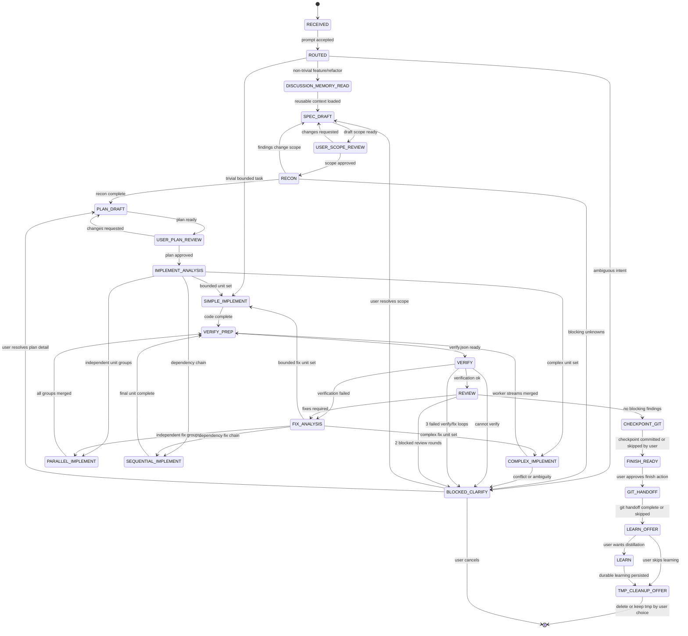
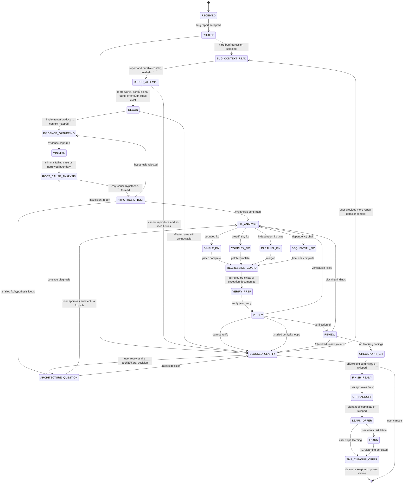
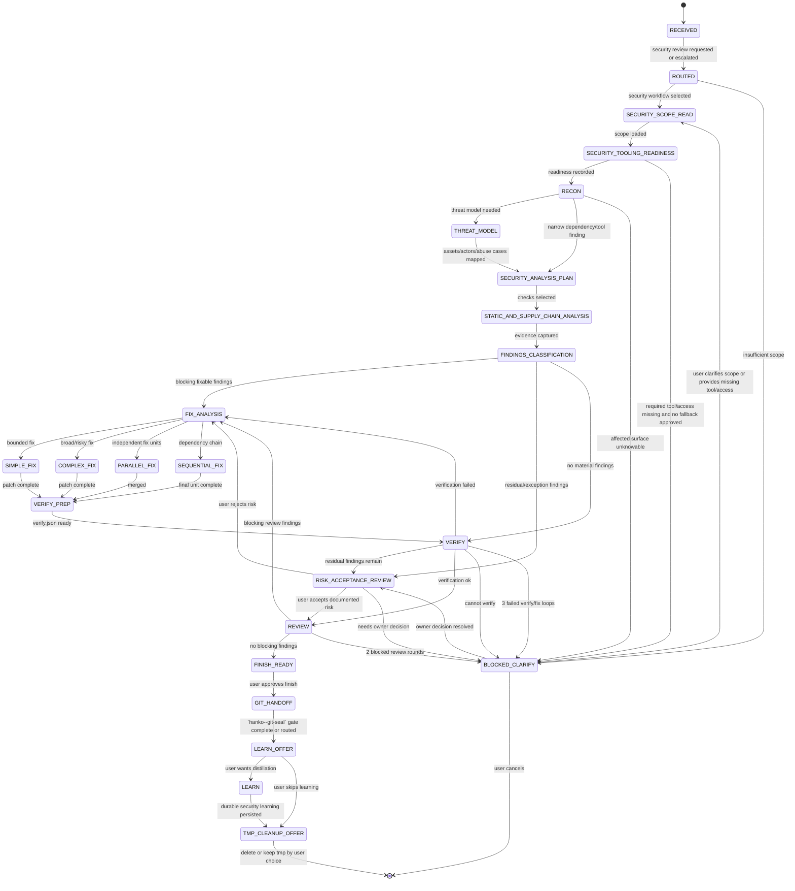
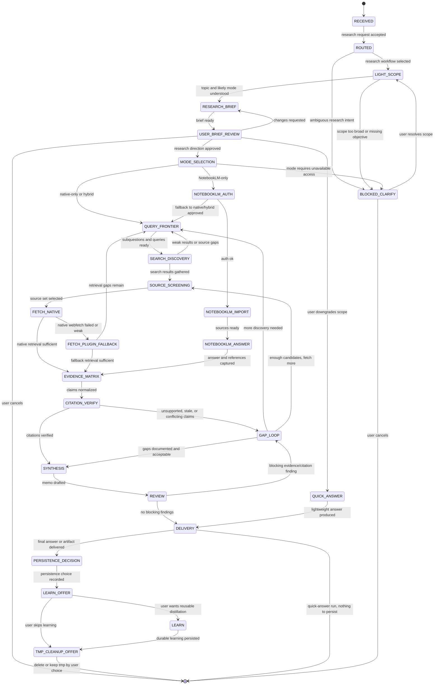
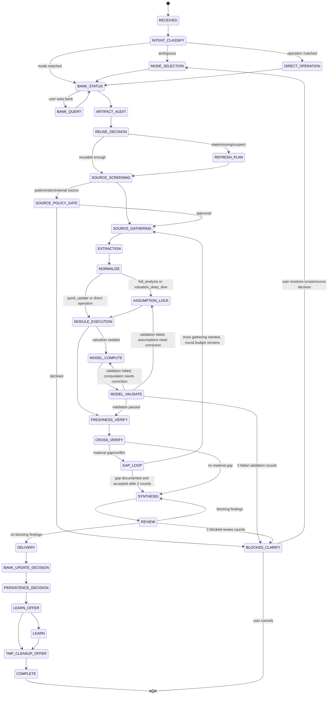

# Workflows Reference

Runtime contract for the v2 OpenCode harness.

---

## Runtime Contract

`scripts/workflow-state.mjs` is the sole writer of workflow runtime state.

- Commands: `init`, `read`, `advance`, `gate`
- Exit codes: `0` success, `1` error, `2` critical gate, `5` caller not in the workflow's allowed-callers set, `6` unresolved critical gate verdict blocking a terminal/delivery transition, `9` CAS conflict
- Workflow IDs: `wf1`, `wf2`, `wf3`, `wf4`, `wf5`
- Invalid transitions are rejected.
- Ownership is DAG-based, not single-owner-for-life: `state.specialist` (set at `init`) is an audit/display field only — any agent documented as owning at least one state in that workflow (per the spec's state-ownership tables) may call `advance`/`gate` on that workflow instance, not only the agent that called `init`. `workflow-state.mjs` hardcodes a per-workflow allowed-callers table (`WORKFLOW_ALLOWED_CALLERS`) derived from those tables; a caller outside that set is rejected with exit `5`.
- Gate loop caps are enforced by the state engine, not by prompt text alone.
- **Delivery gate**: `cmdAdvance` blocks entry into each workflow's terminal/delivery-adjacent state (`FINISH_READY` for WF1-WF3, `DELIVERY` for WF4/WF5 — see `WORKFLOW_TERMINAL_STATES` in `workflow-state.mjs`) while any gate verdict recorded on that workflow instance is still `critical` (exit `6`). A later `gate` call for the same gate name that records a different verdict (e.g. `escalate`) resolves it. This supersedes the retired `plugins/gates/nurikabe.js` plugin hook, which bound to a `deliver` tool that never existed in OpenCode's tool set and never fired in a real session — `nurikabe.js` is kept in the repo with a `SUPERSEDED` header for institutional memory but is no longer registered in `config/opencode.jsonc`.

Canonical command shapes:

```bash
bun scripts/workflow-state.mjs init \
  --cwd "$CWD" --workflow wf1 \
  --specialist <owner> --phase <initial-phase> --session <session-id>

bun scripts/workflow-state.mjs advance \
  --cwd "$CWD" --workflow wf1 \
  --to <next-phase> --expected-rev <n> \
  --session <session-id> --caller <owner>

bun scripts/workflow-state.mjs gate \
  --cwd "$CWD" --workflow wf1 \
  --gate <gate-name> --verdict <ok|warn|critical> \
  --max-iterations <n> --session <session-id> --caller <owner>
```

---

## Shared Rules

### `BLOCKED_CLARIFY` resume rule

When the user's answer changes scope or plan, follow the explicit `BLOCKED_CLARIFY` exits drawn in the state machine. When the answer only removes an operational blocker — for example a missing tool, credential, or environment dependency — resume at the state that raised the block instead of jumping back to an earlier draft state.

### Loop caps

| Loop | Cap | Applies to |
|---|---:|---|
| Verify/fix loop | 3 rounds | WF1, WF2, WF3 |
| Review loop | 2 blocked rounds | WF1, WF2, WF3, WF5 |
| Debug hypothesis/fix loop | 3 rounds, then `ARCHITECTURE_QUESTION` | WF2 |
| Research gap loop | 2 rounds, then synthesize with downgraded confidence | WF4 |
| Finance gap loop | 2 rounds, then synthesize with downgraded confidence | WF5 |
| Finance model validation loop | 3 rounds | WF5 |

### Closing-prompt consolidation

`LEARN_OFFER` and `TMP_CLEANUP_OFFER` remain separate tracked states, but present them as one closing prompt. WF5 applies the same rule to `BANK_UPDATE_DECISION`, `PERSISTENCE_DECISION`, `LEARN_OFFER`, and `TMP_CLEANUP_OFFER`: one consolidated closing card, not a chain of trivial prompts.

---

## Shared Artifact Ledger

### Temporary workflow artifacts

| Artifact | Path |
|---|---|
| Workflow tmp root | `.opencode/tmp/<workflow-id>/` |
| Scope notes | `.opencode/tmp/<workflow-id>/scope.md` |
| Recon packet | `.opencode/tmp/<workflow-id>/recon-packet.md` |
| Scout packet | `.opencode/tmp/<workflow-id>/scout-packet.md` |
| Security triage | `.opencode/tmp/<workflow-id>/security-triage.md` |
| Implementation analysis | `.opencode/tmp/<workflow-id>/implementation-analysis.md` |
| Worker briefs | `.opencode/tmp/<workflow-id>/worker-briefs/*.md` |
| Worker results | `.opencode/tmp/<workflow-id>/worker-results/*.md` |
| Verification manifest | `.opencode/tmp/<workflow-id>/verify.json` |
| Verification output | `.opencode/tmp/<workflow-id>/verification-output.json` |
| Verification summary | `.opencode/tmp/<workflow-id>/verification-summary.md` |
| Review findings | `.opencode/tmp/<workflow-id>/review-findings.md` |
| Fix analysis | `.opencode/tmp/<workflow-id>/fix-analysis.md` |
| Finish summary | `.opencode/tmp/<workflow-id>/finish-summary.md` |
| WF3 tooling readiness | `.opencode/tmp/<workflow-id>/security-tooling-readiness.md` |
| WF4 evidence matrix | `.opencode/tmp/<workflow-id>/evidence-matrix.md` |
| WF4 citation verification | `.opencode/tmp/<workflow-id>/citation-verification.md` |
| WF5 source manifest | `.opencode/tmp/<workflow-id>/source-manifest.json` |
| WF5 artifact audit | `.opencode/tmp/<workflow-id>/artifact-audit.json` |
| WF5 freshness ledger | `.opencode/tmp/<workflow-id>/freshness-ledger.json` |
| WF5 extraction ledger | `.opencode/tmp/<workflow-id>/extraction-ledger.json` |
| WF5 assumption register | `.opencode/tmp/<workflow-id>/assumption-register.json` |
| WF5 valuation input | `.opencode/tmp/<workflow-id>/valuation-input.json` |
| WF5 model validation report | `.opencode/tmp/<workflow-id>/model-validation.json` |
| WF5 module-run registry | `.opencode/tmp/<workflow-id>/module-runs.json` |

### Durable artifacts

| Artifact | Path |
|---|---|
| Spec doc | `docs/superpowers/specs/<topic>-design.md` |
| Plan file | `docs/superpowers/plans/<topic>-plan.md` |
| Learning file | `docs/learnings/<topic>-learning.md` |
| RCA file | `docs/postmortems/<topic>-rca.md` |
| Security file | `docs/security/<topic>-security.md` |
| Verification file | `docs/verification/<topic>-verification.md` |
| Finance artifact registry | `research/financial/<subject-slug>/artifact-registry.json` |
| Finance bank manifest | `research/financial/<subject-slug>/bank-manifest.json` |
| Bank update log | `research/financial/<subject-slug>/bank-updates.jsonl` |
| Source registry | `research/financial/<subject-slug>/source-registry.md` |
| Data manifest | `research/financial/<subject-slug>/data-manifest.json` |
| Durable freshness ledger | `research/financial/<subject-slug>/freshness-ledger.json` |
| Durable extraction ledger | `research/financial/<subject-slug>/extraction-ledger.json` |
| Assumptions register | `research/financial/<subject-slug>/assumptions-register.yaml` |
| Model inputs | `research/financial/<subject-slug>/model-inputs.json` |
| Model output | `research/financial/<subject-slug>/model-output.json` |
| Citation verification | `research/financial/<subject-slug>/citation-verification.md` |
| Research memo | `research/financial/<subject-slug>/research-memo.md` |
| Valuation memo | `research/financial/<subject-slug>/valuation-memo.md` |
| Evidence appendix | `research/financial/<subject-slug>/evidence-appendix.md` |
| Thesis history | `research/financial/<subject-slug>/thesis-history.md` |
| Finance knowledge index | `docs/knowledge/finance/index.md` |
| Finance reusable knowledge | `docs/knowledge/finance/<pattern-or-subject>.md` |

---

## Workflow #1 — Non-Trivial Multi-File Feature

Trigger: user asks for a non-trivial feature, refactor, or implementation crossing multiple files.

Owner route: `kantoku--workflow-director` -> `kyakuhon--spec-planner` -> `tsukumogami--code-forgemaster` / `general` / `kagami--verifier` as needed.



---

## Workflow #2 — Debug a Hard Bug

Trigger: user reports a hard bug, failing test, runtime error, or regression where root cause is unclear.



---

## Workflow #3 — Security Analysis / Security Remediation

Trigger: explicit security review/audit, security-sensitive diff, dependency/tool/MCP/plugin/installer/CI change, auth/crypto/secrets/path traversal/command execution surface, an `escalate` verdict from Workflow #1/#2 security triage, or a `hanko--git-seal` finish-gate finding that needs deeper security analysis.



---

## Workflow #4 — Deep Research With Multi-Source Citations

Trigger: user asks for deep research, current information, literature review, competitive intelligence, domain synthesis, or a cited research memo.



`QUICK_ANSWER` runs skip `PERSISTENCE_DECISION`, `LEARN_OFFER`, and `TMP_CLEANUP_OFFER`.

---

## Workflow #5 — Public Company Financial Analysis

Trigger: public-company analysis, stock analysis, earnings analysis, valuation, DCF, comps, filings extraction, business or growth analysis, sector or macro-aware market research, or a direct finance operation.



WF5 terminal state is `COMPLETE`.
